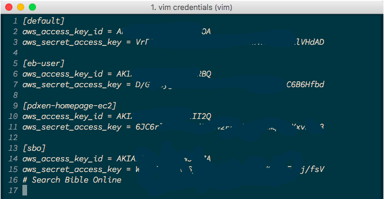
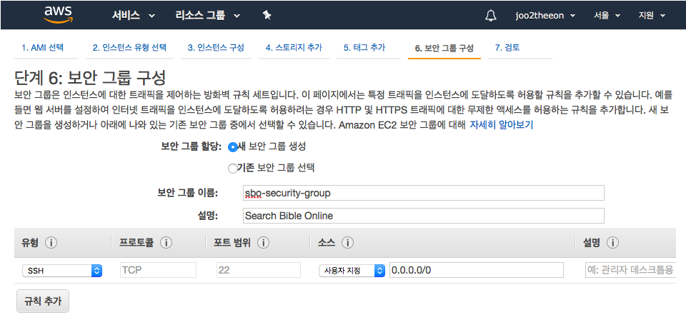

<h1 class="header"><span>[AWS DEPLOY WITH EC2]</span></h1>


# EC2 생성


## 1. IAM 으로 새 유저 생성, 부분적 권한 부여

1. programmatic access 선택 (ssh 접근)
2. attatch existing policies directly 선택, ec2fullaccess 선택
3. cvs 정보 `~/.aws` 에 `credentials`로 저장 

##### `~/.aws/credentials` 를 `vim`으로 연 모습


## 2. 키페어 생성

1. EC2 대시보드 > 키페어 > 키페어 생성
2. 이름 입력하면 `.pem` 파일 다운로드
3. `.pem` 파일 `~/.ssh/`에 저장
4. `chmod 400 <pem_file_name>` 소유주만 읽을 수 있게 변경

> 키페어 이름은 변경해도 상관없다. 내가 알아볼 수만 있으면 된다.

## 3. 인스턴스 시작하기
: 인스턴스는 AWS 에서 제공하는 가상 컴퓨터 환경의 최소단위이다.

1. EC2 대시보드 > 인스턴스 > 인스턴스 생성
2. `ubuntu 16.04` 선택
3. cpu 능력치 선택
4. 세부 설정에서 보안그룹 선택 (처음 시작하는 인스턴스는 새로 생성하면 된다)
5. 검토 및 시작
6. 키페어 선택
7. 인스턴스 생성 (시간이 좀 걸린다)
8. 인스턴스를 생성하면 가상환경 내부의 `ubuntu` 유저가 기본적으로 생성된다. 

##### 인스턴스 생성시 보안그룹 생성


## 4. 인스턴스 접근하기

### 1. ssh 를 이용한 접근
: `ssh -i 키페어 유저이름@퍼블릭DNS주소`
	
```bash
>>> ssh -i ~/.ssh/pdxen-homepage-ec2-keypair.pem ubuntu@ec2-13-125-207-58.ap-northeast-2.compute.amazonaws.com
	
The authenticity of host 'ec2-13-125-207-58.ap-northeast-2.compute.amazonaws.com (13.125.207.58)' can't be established.
ECDSA key fingerprint is SHA256:iJJAYYiAltP2X0zw9Hz3VhtXyTpOI9bqofKwUJkUq6w.
Are you sure you want to continue connecting (yes/no)? 
	
>>> yes
	
Warning: Permanently added 'ec2-13-125-207-58.ap-northeast-2.compute.amazonaws.com,13.125.207.58' (ECDSA) to the list of known hosts.
Welcome to Ubuntu 16.04.3 LTS (GNU/Linux 4.4.0-1049-aws x86_64)
	
 * Documentation:  https://help.ubuntu.com
 * Management:     https://landscape.canonical.com
 * Support:        https://ubuntu.com/advantage
	
  Get cloud support with Ubuntu Advantage Cloud Guest:
    http://www.ubuntu.com/business/services/cloud
	
0 packages can be updated.
0 updates are security updates.
	
	
	
The programs included with the Ubuntu system are free software;
the exact distribution terms for each program are described in the
individual files in /usr/share/doc/*/copyright.
	
Ubuntu comes with ABSOLUTELY NO WARRANTY, to the extent permitted by
applicable law.
	
To run a command as administrator (user "root"), use "sudo <command>".
See "man sudo_root" for details.
	
ubuntu@ip-172-31-30-125:~$
```
	
앞으로 이 인스턴스는 밥먹듯이 접근해야 한다. 그런데 매번 키를 입력하기는 번거롭다. 터미널 히스토리를 사용하니 크게 귀찮지 않다고 생각할 수도 있지만, 이런 인스턴스가 여러개가 되면 그땐 진짜 문제다. 
	
우리는 프로그래머다. 이걸 단순화 시킬 방법이 없을리 만무하다.  


### 2. ssh config file 로 정보입력 자동화하기

ssh 연결의 정보를 담고 있는 config 파일을 만들어주자
	
```bash
vim ~/.ssh/config
```
	
```
# ~/.ssh/config
Host pdxenhp
	HostName ec2-52-78-39-75.ap-northeast-2.compute.amazonaws.com
	IdentityFile ~/.ssh/pdxen-homepage-ec2-keypair.pem
	User ubuntu
```
이제 다음과 같이 간단하게 접속할 수 있다. 
	
```bash
ssh pdxenhp
```


# 서버 Ubuntu 환경설정


### 1. locale 설정

```bash
ubuntu >>> sudo vim /etc/default/locale
``` 

```bash
# /etc/default/locale 
LC_CTYPE="en_US.UTF-8"
LC_ALL="en_US.UTF-8"
LANG="en_US.UTF-8"
``` 

#### locale 이란 

* **locale**: locale은 지역별로 다른 언어, 날짜, 시간 등의 표시 방법을 결정하는 설정을 말한다. 
* **ubuntu의 locale 설정 파일**: `/etc/default/locale`
* **한국의 locale 설정**: `ko_KR.UTF-8` 
* 기타: 외국계 기업에서 제공하는 우분투 이미지의 경우에는 `en_US.UTF-8`일 가능성이 높으나 AWS EC2 처럼 locale 설정 일부가 비어있을 수 있다. 그럴 때는 locale file을 직접 변경해주면 된다.  

#### locale 변수의 종류

> ubuntu locale 변수의 종류에는 다음과 같은 것들이 있다. 확실하지는 않으나, `""` 존재 여부는 별로 상관 없는 것 같다.

* `LC_ALL` : 모든 카테고리의 locale을 한 번에 설정하는 환경변수이다. `LC_*`과  `LANG`을 포함한 어떤 것보다도 높은 우선순위를 지닌다. 따라서 `LC_ALL`을 설정하면 다른 locale 카테고리의 값들이 `LC_ALL`의 값으로 변경된다. `LC_ALL`설정을 없애면 이전값을 유지한다.  
* `LANGUAGE` : locale의 다중 설정을 위해 `gettext`에서 사용되는 `GNU extension` 환경변수로, `LC_ALL`보다도 우선순위가 높다. locale들은 구분문자 `:` 을 이용하여 우선순위 순서대로 나열된다. (ex. `LANGUAGE=en_US:ko_KR`)  
* `LANG` : 모든 카테고리에 대한 locale 설정을 위한 환경변수이다. 하지만 `LC_*` 환경변수보다 우선 순위가 낮다.  
* `LC_CTYPE` : 문자 분류(알파벳, 숫자, 한글 또는 소문자, 대문자 등), 변환, 대소문자 비교을 위한 locale 설정을 의미한다.  


### 2. 기타 업데이트 
> `Do you want to continue? [Y/n]`와 같은 메세지가 나오면, `Y`를 입력하거나 엔터키를 누르면 된다.

* **ubuntu 패키지 정보 업데이트**: `sudo apt-get update`
* 설치되어 있는 패키지들을 의존성 검사하며 업그레이드: `sudo apt-get dist-upgrade`
* **pip** 설치: `sudo apt-get install python-pip`
* **zsh** 설치: `sudo apt-get install zsh`
* **oh-my-zsh** 설치: `sudo curl -L http://install.ohmyz.sh | sh`
* **Default shell 변경**: `sudo chsh ubuntu(유저명) -s /usr/bin/zsh`  
(shell 변경 후엔 exit로 연결을 종료한 뒤 재연결)

### 3. pyenv 설치

1. Pyenv Requirements 설치
	
	```bash
	sudo apt-get install -y make build-essential libssl-dev zlib1g-dev libbz2-dev \
	libreadline-dev libsqlite3-dev wget curl llvm libncurses5-dev libncursesw5-dev \
	xz-utils tk-dev
	```

2. pyenv 설치

	```bash
	curl -L https://raw.githubusercontent.com/yyuu/pyenv-installer/master/bin/pyenv-installer | bash
	```

3. pyenv zsh 설정

	`~/.zshrc`에 추가

	```bash
	export PATH="/home/ubuntu/.pyenv/bin:$PATH"
	eval "$(pyenv init -)"
	eval "$(pyenv virtualenv-init -)"
	```
4. Pillow를 위한 Python 라이브러리 설치 (Django 에서 Pillow 를 사용하는 경우에만 해당)

	```bash
	sudo apt-get install python-dev python-setuptools
	```

### 4. Django 환경설정

장고 프로젝트는 `root` 디렉토리의 `srv` 폴더에 업로드한다.
`srv` 폴더의 소유자를 `ubuntu` 로 변경한다. (원래는 `root`)

```bash
sudo chown -R ubuntu:ubuntu /srv/
```


# Django project 업로드


* django `ALLOWED_HOSTS` 변경

	```python
	ALLOWED_HOSTS = [
		'localhost',
		'127.0.0.1',
		'.ap-northeast-2.compute.amazonaws.com',
	]
	```
* scp로 서버에 프로젝트 업로드 (`/srv/` 아래에 프로젝트 폴더 통째로 이동) 
	
	```bash
	scp -i <keypair_path> -r <project_dir_path> <username>@publicDNS:<target_dir_path>
	```
	```bash
	# pdxen-homepage-pj/ 상위 디렉토리 기준
	# 상위 디렉토리를 기준으로 하지 않으면 /srv/pdxen-homepage-pj/와 연결해야 한다. 
	scp -i ~/.ssh/pdxen-homepage-ec2-keypair.pem -r pdxen-homepage-pj/ ubuntu@ec2-52-78-39-75.ap-northeast-2.compute.amazonaws.com:/srv/
	```
	`~/.ssh/config` 파일을 설정해두었다면, 다음과 같이 할 수 있다.
	
	```bash
	# pdxen-homepage-pj/ 상위 디렉토리 기준
	# 상위 디렉토리를 기준으로 하지 않으면 /srv/pdxen-homepage-pj/와 연결해야 한다. 
	scp -r pdxen-homepage-pj/ pdxenhp:/srv/
	```
	
* 서버에 python 가상환경 설정
	
	```bash
	>>> pyenv install --list	# 사용가능한 버전 확인
	>>> pyenv install 3.6.3		# 원하는 버전 사용
	>>> pyenv virtualenv 3.6.3 pdxen-homepage # 원래 프로젝트에서 사용하던 가상환경 이름
	# 아래는 당연하게도, 프로젝트 폴더에서 해야 한다. 
	>>> pyenv local pdxen-homepage # `.python_version` 파일이 local env 정보를 가지고 있지만 에러를 방지하기 위해 해주는 것이 좋다
	>>> pip install -r requirements.txt	# requirements 설치
	>>> pip install --upgrade pip	# pip upgrade가 필요하다는 경고가 뜨는 경우
	```
	
	> ubuntu:16.04의 system python==2.7 이다. pyenv를 설치하고 local을 해주지 않으면 아무리 `.python_version` 파일이 있다고 해도 `pip` 명령을 내릴 때 종종 오류가 난다. 왠지는 모르겠다. `pip -V`을 통해 `pip`에서 사용하는 `python version`을 확인할 수 있다.  
	> ##### 확인할 사항  
	> pip install 을 먼저하면 pip가 2.7이 되는 건가?  
	> 아니면 나중에 upgrade 하면 3.6으로 바뀌나?
	>
	> ##### pip version에서 사용하는 python version이 `2.*`인 경우 Django2.0 지원이 안 된다. 
	> 
	> ```bash
	(pdxen-homepage) ➜  pdxen-homepage-pj git:(master) ✗ pip -V
	pip 9.0.1 from /home/ubuntu/.local/lib/python2.7/site-packages (python 2.7)
	(pdxen-homepage) ➜  pdxen-homepage-pj git:(master) ✗ pip install Django==2.0.2
	Collecting Django==2.0.2
	  Could not find a version that satisfies the requirement Django==2.0.2 
	  (from versions: 1.1.3, 1.1.4, 1.2, 1.2.1, 1.2.2, 1.2.3, 1.2.4, 1.2.5, 
	  1.2.6, 1.2.7, 1.3, 1.3.1, 1.3.2, 1.3.3, 1.3.4, 1.3.5, 1.3.6, 1.3.7, 1.4, 
	  1.4.1, 1.4.2, 1.4.3, 1.4.4, 1.4.5, 1.4.6, 1.4.7, 1.4.8, 1.4.9, 1.4.10, 
	  1.4.11, 1.4.12, 1.4.13, 1.4.14, 1.4.15, 1.4.16, 1.4.17, 1.4.18, 1.4.19, 
	  1.4.20, 1.4.21, 1.4.22, 1.5, 1.5.1, 1.5.2, 1.5.3, 1.5.4, 1.5.5, 1.5.6, 
	  1.5.7, 1.5.8, 1.5.9, 1.5.10, 1.5.11, 1.5.12, 1.6, 1.6.1, 1.6.2, 1.6.3, 
	  1.6.4, 1.6.5, 1.6.6, 1.6.7, 1.6.8, 1.6.9, 1.6.10, 1.6.11, 1.7, 1.7.1, 
	  1.7.2, 1.7.3, 1.7.4, 1.7.5, 1.7.6, 1.7.7, 1.7.8, 1.7.9, 1.7.10, 1.7.11, 
	  1.8a1, 1.8b1, 1.8b2, 1.8rc1, 1.8, 1.8.1, 1.8.2, 1.8.3, 1.8.4, 1.8.5, 1.8.6, 
	  1.8.7, 1.8.8, 1.8.9, 1.8.10, 1.8.11, 1.8.12, 1.8.13, 1.8.14, 1.8.15, 1.8.16, 
	  1.8.17, 1.8.18, 1.9a1, 1.9b1, 1.9rc1, 1.9rc2, 1.9, 1.9.1, 1.9.2, 1.9.3, 
	  1.9.4, 1.9.5, 1.9.6, 1.9.7, 1.9.8, 1.9.9, 1.9.10, 1.9.11, 1.9.12, 1.9.13, 
	  1.10a1, 1.10b1, 1.10rc1, 1.10, 1.10.1, 1.10.2, 1.10.3, 1.10.4, 1.10.5, 
	  1.10.6, 1.10.7, 1.10.8, 1.11a1, 1.11b1, 1.11rc1, 1.11, 1.11.1, 1.11.2, 
	  1.11.3, 1.11.4, 1.11.5, 1.11.6, 1.11.7, 1.11.8, 1.11.9, 1.11.10)
	No matching distribution found for Django==2.0.2
	```


# runserver 로 돌려보기

### 1. 보안그룹 변경

ssh를 통한 22번 포트에서만 들어올 수 있던 인바운드 환경을 변경해야 한다. 
: 사용자 지정 TCP, `8080` 포트, 소스는 `0.0.0.0/0, ::/0` 

### 2. `./managy.py runserver`

```bash
# 0 은 인바운드 ip를 나타낸다. 어디서든 들어올 수 있는 것.
# `manage.py`의 상위폴더 기준이다
./manage.py runserver 0:8080

# 쉘의 어디서나 runserver 명령을 수행할 수 있게 alias를 만들어 줄 수 있다.
# ~/.zshrc
alias run="/srv/pdxen-homepage-pj/pdxenhomepage/manage.py runserver"
```


# uWSGI 설치

> ### WSGI란
> - Web Server Gateway Interface의 약자로, 파이썬 기반의 웹앱 또는 웹프레임워크와 웹 서버간 interface를 위한 규칙이다. 이 규칙을 기반으로 만든 interface framwork가 uwsgi인 것.  
> - 일반적으로는 uwsgi만을 사용해서 서비스를 제공하지 않는다. 보통 Nginx를 통해 Static Content를 관리하고 Reverse Proxying을 통해서 나머지 Request를 uwsgi에게 전달한다. 반드시 Nginx와 같이 써야 하는 것은 아니고, uWSGI만도 가능하다. 하지만 Nginx의 보다 향상된 Static Content핸들링은 서버에 발생되는 Load를 줄인다. 
> 
> 참고: [nginx-uwsgi-django system structure](nginx-uwsgi-django-system.md)

### 1. 우분투 deploy 유저 생성

: 서버에 `deploy`라는 이름의 유저를 생성해준다. 보안을 위해 각 기능별로 유저를 구분하는 것이 좋다. 

```bash
sudo adduser deploy
```

### 2. pyenv 가상환경 생성, 적용

```bash
# python version은 프로젝트 python requirements version에 맞추자
# 가상환경 이름으로써의 uwsgi는 uwsgi 명령어와 혼동될 수 있으므로 사용하지 말자  
pyenv virtualenv 3.6.3 uwsgi-env
# 특정한 디렉토리에 설정할 필요가 없기 때문에 쉘에 설정한다.
pyenv shell uwsgi-env
```
> ##### pyenv shell 
> - 쉘의 `PYENV_VERSION` 환경변수를 변경함으로써 로컬 env 설정을 무시하고 특정 버전의 env를 설정하는 것
> - 프로그램을 설치할 환경이 필요하나, 그 환경을 특정 디렉토리에 설정할 필요가 없을 때 사용한다.
> - `pyenv shell --unset`으로 되돌릴 수 있다.

### 3. uWSGI 설치

```bash
pip install uwsgi
```

### 4. uWSGI 동작 확인

```bash
# uwsgi 명령어를 사용할 수 있는 환경을 만들어준다
pyenv shell uwdgi-env
```

```bash
uwsgi \
# 인바운드 포트 번호. 우리는 브라우저 요청을 받을 것이므로 8080
--http :<port> \
# 우리 프로젝트가 돌아가는 가상환경
--home <django_project_virtualenv_version_path> \
# 작업 폴더를 프로젝트 폴더로 변경
--chdir <project_dir> \
# 프로젝트의 uwsgi.py 설정파일 위치
# chdir 의 경로가 python 소스루트라는 가정하에 불러오므로, 파이썬에서 모듈을 부르는 방식대로 쓰면 된다
-w <wsgi 모듈명>.wsgi
```
이번 프로젝트인 `pdxen-homepage-pj`의 경우에는 다음과 같다. 

```bash
uwsgi \
--http :8080 \
--home /home/ubuntu/.pyenv/versions/pdxen-homepage \
--chdir /srv/pdxen-homepage-pj/pdxenhomepage/ \
-w config.wsgi
```
`uwsgi`는 static 파일을 읽어오지 못하기 때문에, css와 image가 깨진 페이지가 로드되는 것을 확인할 수 있다. 이 문제를 해결하기 위해서는 `nginx`를 사용해야 한다. 

다음과 같은 내용이 나오면 성공이다.

```bash
*** Starting uWSGI 2.0.17.1 (64bit) on [Sun Nov  4 11:12:10 2018] ***
compiled with version: 5.4.0 20160609 on 04 November 2018 11:07:53
os: Linux-4.4.0-1065-aws #75-Ubuntu SMP Fri Aug 10 11:14:32 UTC 2018
nodename: ip-172-31-27-31
machine: x86_64
clock source: unix
detected number of CPU cores: 1
current working directory: /home/ubuntu
detected binary path: /home/ubuntu/.pyenv/versions/3.6.3/envs/uwsgi-env/bin/uwsgi
!!! no internal routing support, rebuild with pcre support !!!
chdir() to /srv/todo-management/todo
*** WARNING: you are running uWSGI without its master process manager ***
your processes number limit is 3900
your memory page size is 4096 bytes
detected max file descriptor number: 1024
lock engine: pthread robust mutexes
thunder lock: disabled (you can enable it with --thunder-lock)
uWSGI http bound on :8080 fd 4
spawned uWSGI http 1 (pid: 23110)
uwsgi socket 0 bound to TCP address 127.0.0.1:44717 (port auto-assigned) fd 3
Python version: 3.6.3 (default, Nov  4 2018, 10:23:25)  [GCC 5.4.0 20160609]
PEP 405 virtualenv detected: /home/ubuntu/.pyenv/versions/todo
Set PythonHome to /home/ubuntu/.pyenv/versions/todo
*** Python threads support is disabled. You can enable it with --enable-threads ***
Python main interpreter initialized at 0x1e73690
your server socket listen backlog is limited to 100 connections
your mercy for graceful operations on workers is 60 seconds
mapped 72920 bytes (71 KB) for 1 cores
*** Operational MODE: single process ***
WSGI app 0 (mountpoint='') ready in 0 seconds on interpreter 0x1e73690 pid: 23074 (default app)
*** uWSGI is running in multiple interpreter mode ***
spawned uWSGI worker 1 (and the only) (pid: 23074, cores: 1)
```
마지막 줄이 핵심이다. 

```bash
*** uWSGI is running in multiple interpreter mode ***
spawned uWSGI worker 1 (and the only) (pid: 23074, cores: 1)
```


# ini file 로 uWSGI 돌리기


### 1. 파일 경로

: 장고 프로젝트 폴더 바로 밑에, 어플리케이션 폴더(소스루트) 바로 위에 `.config/uwsgi/pdxenhomepage.ini`

### 2. ini 파일 작성

```ini
[uwsgi]
chdir = /srv/프로젝트 폴더/장고 어플리케이션 폴더  (소스루트 설정)
module = <소스루트 기준  wsgi.py위치>:application(wsgi파일 안의 상수)  (wsgi설정 위치)
home = /home/ubuntu/.pyenv/versions/가상환경이름  (가상환경 경로)

uid = deploy  (uwsgi를 실행할 유저 이름)
gid = deploy  (그 유저가 속한 그룹 이름)

http = :8080  (인바운트 포트)

enable-threads = true  (스레드 사용)
master = true  (마스터 프로세스 사용)
vacuum = true  (실행시 자동 생성되는 파일 또는 소켓들을 종료시 삭제)
pidfile = /tmp/어플리케이션이름.pid  (pidfile 이 생성될 폴더의 경로를 설정)
logto = /var/log/uwsgi/어플리케이션이름/@(파일명생성로직).log  (로그 저장 위치)
log-reopen = true  (uwsgi를 재시작할 때 로그를 다시 열어주는 옵션)
```


* `pidfile`: linux에서 실행되는 프로세스의 id 값을 저장하는 파일
* 로그를 저장하는 디렉토리는 직접 생성해줘야 한다. (`/var/log/uwasgi/앱이름/`)


이번 프로젝트인 `pdxen-hompage-pj`의 경우에는 다음과 같다

```ini
[uwsgi]
chdir = /srv/pdxen-homepage-pj/pdxenhomepage
module = config.wsgi:application	
home = /home/ubuntu/.pyenv/versions/pdxen-homepage

uid = deploy
gid = deploy

http = :8080

enable-threads = true
master = true
vacuum = true
pidfile = /tmp/pdxenhomepage.pid
logto = /var/log/uwsgi/pdxenhomepage/@(exec://date +%%Y-%%m-%%d).log
log-reopen = true
```

### 3. ini file 로 uWSGI 돌리기

scp로 변경된 프로젝트 폴더를 업데이트 해준다. 변경된 부분만 해주어도 큰 상관이 없지만 귀찮으니 프로젝트 폴더 전체를 복사한다.

```bash
# pdxen-homepage-pj/ 상위 디렉토리 기준
scp -r pdxen-homepage-pj/ pdxenhp:/srv/
```

ssh로 서버 접속, 로그 디렉토리 생성

```bash
ssh pdxenhp
```

```bash
# -p option: path 중간에 생성되지 않은 디렉토리까지 전부 생성
sudo mkdir -p /var/log/uwsgi/pdxenhomepage/
```

ini 파일로 uwsgi 돌리기. `sudo`로 실행하는 경우에는 `uwsgi` 실행파일 경로를 전부 써주어야 한다. 

```bash
sudo /home/ubuntu/.pyenv/versions/uwsgi-env/bin/uwsgi -i /srv/pdxen-homepage-pj/.config/uwsgi/pdxenhomepage.ini 
```

### 4. uWSGI 로그 확인

```bash
# 또는 로그 저장 위치로 직접 가서 vim 으로 열면 된다. 안 열릴 시 sudo
sudo cat /var/log/uwsgi/mysite/<logfile>.log
```


# Nginx 설치

> ##### 웹 서버는 아래의 두 가지 중 하나의 의미를 지닌다
> 1. 클라이언트로부터 HTTP 요청을 받아 HTML 문서와 같은 웹 페이지를 반환하는 프로그램
> 2. 위에 언급한 기능을 제공하는 컴퓨터 프로그램을 실행하는 컴퓨터
> 
> ##### 첫번째 의미의 웹 서버
> 
> - 웹 서버의 주된 기능은 웹 페이지를 클라이언트로 전달하는 것이다. 주로 그림, CSS, 자바스크립트를 포함한 HTML 문서가 클라이언트로 전달된다.
> - 흔히 웹 브라우저 또는 웹 크롤러로 부르는 클라이언트는 HTTP를 통해 리소스를 요청하며 서버는 해당 리소스를 반환하거나 처리할 수 없을 경우 에러 메시지를 전달한다.
> - 클라이언트로부터 콘텐츠를 전달 받는 것도 웹 서버의 한 기능이다. 파일 업로드를 포함하여 클라이언트에서 제출한 웹 폼을 수신하기 위해 사용된다.
> - 보통 대다수의 웹 서버는 Active Server Page(ASP), PHP 등의 서버 사이드 스크립트 언어(Server-side scripting)를 지원한다. 이는 서버 소프트웨어의 변경 없이도 웹 서버가 수행할 동작을 분리된 서버 사이드 스크립트 언어에 기술할 수 있다는 의미이다. 보통 서버 사이드 스크립트 언어를 통해 구현되는 기능이란 HTML 문서를 동적으로 생성하는 것을 말한다. 이렇게 동적으로 생성된 HTML 문서는 동적 컨텐트라 하는데 주로 데이터베이스의 정보를 조회해서 보여주거나 수정하기 위해 사용된다. 동적 컨텐트와 대비되는 정적 컨텐트는 더 빠르게 동작하고 쉽게 캐시되지만, 반환되는 컨텐트의 내용이 항상 동일하다.
> - 웹 서버는 월드 와이드 웹 뿐만 아니라 프린터, 라우터, 웹캠과 같은 임베디드 장치, 그리고 근거리 통신망(local network)에서도 사용된다. 시스템의 모니터링 또는 장치 관리를 위한 목적으로 사용되는데, 이렇게 웹 서버는 클라이언트에 다른 소프트웨어의 설치 없이 대부분의 운영체제에 포함된 웹 브라우저만으로 서비스를 제공할 수 있다는 장점이 있다.
> 
> ##### 강력한 서버, Nginx
> : Apache 보다 뛰어난 성능을 내기 위해 만들어졌다. 더 많은 요청을 처리하고, 더 적은 메모리를 소비한다. 대신, 설정을 마음대로 바꿀 수 있는 유연성이 떨어진다. 기존 강자였던 아파치를 꺽고 현재 사용량 1위를 달성 중이다.
> 
> ###### 참조
> [opentutorials.org - nginx 설명](https://opentutorials.org/module/384/3462)  
> [개발자 면접준비 - nginx 설명](https://m.blog.naver.com/jhc9639/220967352282)  

## Nginx 설치

서버에 Nginx를 설치한다. 
> 우분투 소프트웨어 센터는 안정화된 버전 제공을 기본값으로 한다. 안정성보다 최신 버전이 중요한 경우에는 PPA(Personal Package Archive) 를 통해 패키지를 다운로드 받을 수 있다. 최신 버전은 `ppa:nginx/development`, 안정화 버전은 `ppa:nginx/stable`이다  
> 참조: [opentutorials.org](https://opentutorials.org/module/384/4298)

```bash
# PPA 추가를 위한 필요 패키지
sudo apt-get install software-properties-common python-software-properties

# nginx 안정화 최신버전 PPA 추가
sudo add-apt-repository ppa:nginx/stable

# PPA 저장소 업데이트
sudo apt-get update

# nginx 설치
sudo apt-get install nginx
```

설치된 Nginx 버전 확인

```bash
nginx -v
```


## Nginx 환경 설정 (Ubuntu server)

Nginx의 유저를 uwsgi를 설정할 때 사용한 `deploy` 로 바꿔준다. Nginx에서 uwsgi 접근권을 가져야하기 때문인 것 같다.

```bash
# Nginx 설정 파일
sudo vi /etc/nginx/nginx.conf

<nginx.conf>
# user www-data; 를 user deploy; 로 바꾸자
user deploy;
worker_processes auto;
pid /run/nginx.pid;
include /etc/nginx/modules-enabled/*.conf;

events {
        worker_connections 768;
        # multi_accept on;
}
...

```


## Nginx 설정 (Django)

### 1. 설정 파일 경로

: 장고 프로젝트 폴더 바로 밑에, 어플리케이션 폴더(소스루트) 바로 위에 `.config/nginx/pdxenhomepage.conf` uwsgi 설정 파일 구조와 동일하다. 

### 2. 설정 파일 작성하기

```bash
server {
    listen 80;  # 인바운드 포트. 일반적인 브라우저가 접근하는 포트이다.
    server_name *.compute.amazonaws.com *.pdxen.com;  # nginx가 돌아갈 서버 DNS 이름
    charset utf-8;  # 문자 인코딩 방식
    client_max_body_size 128M;  

    location / {
        uwsgi_pass  unix:///tmp/mysite.sock;  # uwsgi 소켓 위치
        include     uwsgi_params;
    }
}
```


## Django Nginx 설정 서버에 반영하기

```bash
# 프로젝트 폴더 (pdxen-homepage-pj)
scp -r 
```


## static file을 못가져오는 경우
1. `DEBUG = False`인가
2. nginx conf file 에 `location /static/`이 잘 선언되어 있는가. (media 가 필요할 때는 그것도)
	
	```
    location /static/ {
        alias /srv/pdxen-homepage-pj/.static_root/;
    }
    location /media/ {
        alias /srv/pdxen-homepage-pj/pdxenhomepage/media/;
    }
    ```
3. `collectstatic`을 해주었는가


