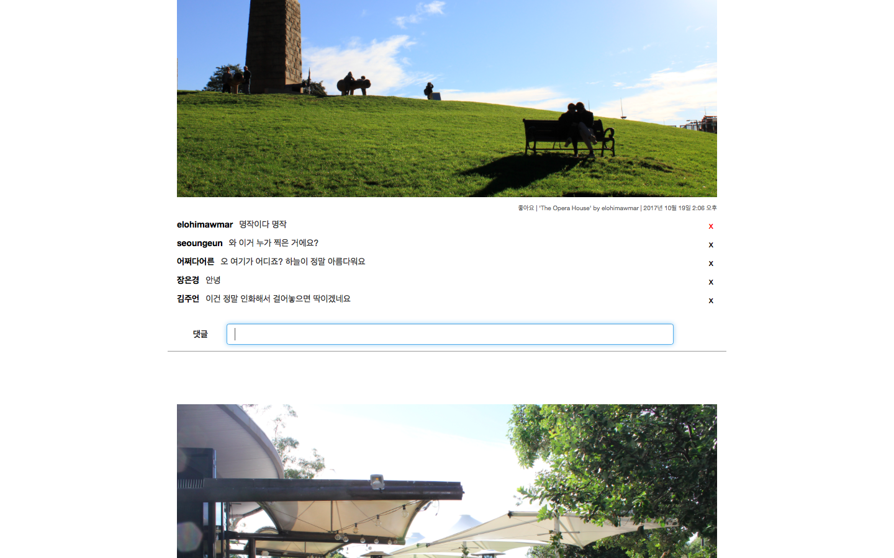
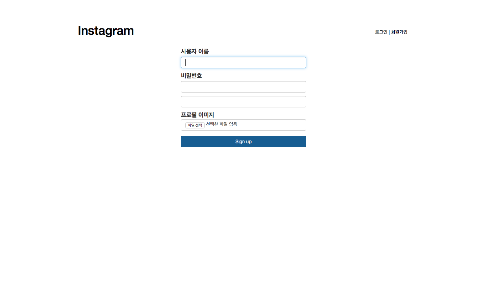
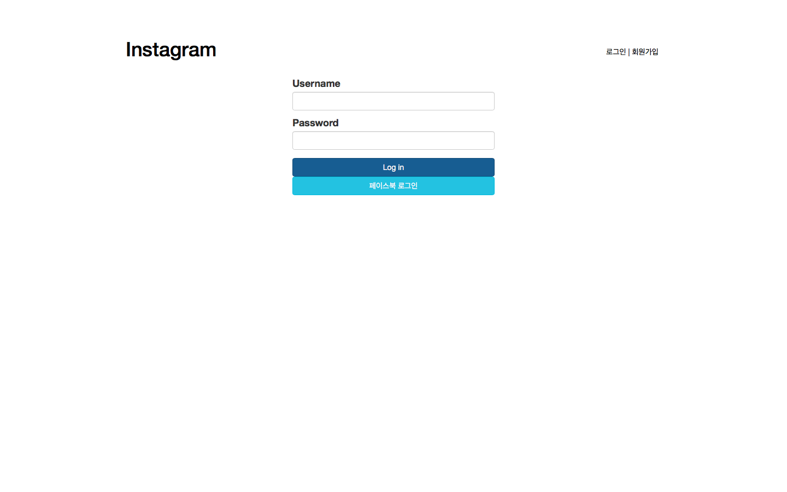

# instagram project

> Git Repository &mdash; <cite>https://github.com/K021/instagram</cite>

이 프로젝트는, 장고와 AWS 를 연습하기 위한 프로젝트로, 인스타그램의 다음과 같은 기능을 구현했다.

- 로그인, 회원가입, 소셜로그인(Facebook)
- Post 와 Comment 모델의 연결
	- 사진 업로드
	- 삭제 (Post 작성자만 삭제 가능, DB에서 지우는 것이 아닌 연결을 끊는 것)
	- 댓글 작성 및 삭제
	- post list 페이지와 detail 페이지
- 좋아요 기능
- 팔로우 기능
- 유저 프로필 페이지, 수정 가능

이 프로젝트에는 `django`, `master`, `deploy` 세 가지 브랜치가 있고, 다음과 같은 차이를 지니고 있다.

##### `django`
- 함수 view
- AWS EC2
- sqlite
- 좋아요 기능까지만

##### `master`
- 클래스 view
- AWS EC2
- postgresql
- 팔로우 기능 추가

##### `deploy`
- AWS EB, S3, RDS
- Docker
- 유저 프로필 페이지 추가
- Django REST api 사용

## 사진 예시

##### 메인화면

##### 오른쪽 위에 커서를 대면 좋아요와 삭제하기 버튼 표시

##### 댓글창 활성, 삭제 버튼 활성

##### 회원가입 페이지

##### 로그인 페이지
