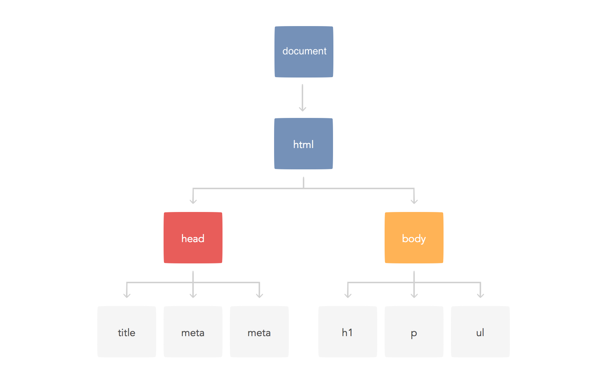

<h1 class='header'><span>Javascript ES6</span></h1>

##### 참고문서
- [MDN: 모질라 개발자 네트워크](https://developer.mozilla.org/ko/)


# 기본

## Statement vs Expression

기본적으로 expression 은 statement 에 포함된다.

- Statement: 명령형 프로그래밍 언어에서, 독립적으로 기능을 수행하는 최소단위이다. 이것이 모여 프로그램을 만든다. (ex. 반복문, 조건문, 함수 선언문, 변수 선언문 등)
- Expression: statement 중, 실행 후 하나의 값으로 환원될 수 있는 것을 의미한다. identifier, literal, operator 만을 포함한다. operator 에는  산술연산자, 불리언 연산자, 함수 호출 연산자 등을 포함한다. (ex, `1 + 2`, `int('37')` 등)

## 변수, 값, 식별자, 리터럴

> 참조 &mdash; <cite>[northcode: String Literals vs String Valuse](http://www.northcode.com/blog/String-Literals-vs-String-Values), [stackoverflow: what does the word literal mean](https://stackoverflow.com/questions/485119/what-does-the-word-literal-mean)</cite>

- 변수(variable): 값을 저장하는 공간. 정확히는 값이 저장된 공간의 시작 주소를 담고 있는 저장 공간으로, 변수에도 할당된 주소가 있다. 
- 식별자(idenifier): 변수를 표기하는 문자. 이 문자롤 보고 컴파일러 또는 인터프리터가 변수를 호출한다.
- 값(value): 변수에 저장되는 데이터. 저장공간에 저장되는 실제 이진 데이터.
- 리터럴(literal): 값을 표기하는 문자. 이 문자를 보고 컴파일러 또는 인터프리터가 어떤 값을 변수에 넣어야 하는지 알 수 있다. 

## 변수와 상수 할당하기

`let`: 타입 지정 없이 변수 할당

```js
let age = 18;
let name;  // 아무 것도 할당하지 않을 경우, 특별한 값인 undefined 가 할당된다.
let is_fail = undefined;  // 아무 것도 할당하지 않는 것과 같다.
let a, b = 3, c;  // 여러개 할당
```

`const`: 상수 할당

## 식별자 이름

변수의 이름을 식별자라고 하는데, 식별자에는 규칙이 있다.

1. 문자, `$`, `_` 로만 시작할 수 있다.
2. 문자, 숫자, `$`, `_` 로만 구성될 수 있다.
3. 문자에는 유니코드 문자가 포함되나, 문자 형태로 표현되는 유니코드만 가능하다 (이모티콘 안 됨)
4. 예악어와 겹치면 안 된다.

문법적으로 강제되는 것은 아니지만 지켜야 하는 convention 이 있다. 

1. 대문자로 시작하는 식별자는 클래스 이거나 상수변수이다.
2. 상수 식별자는 전부 대분자로 쓴다.
3. `_` 로 시작하는 식별자는 아주 특별한 상황 또는 내부 변수에서만 사용한다. 일반적인 경우에는 사용하지 않는다.
4. 제이쿼리를 사용할 경우, `$` 로 시작하는 식별자는 제이쿼리 객체라는 의미이다. 


## 원시 값 (primitive)

원시 값은 immutable 하며, 다음과 같은 것들이 있다:

##### 원시 값의 종류
- 숫자
- 문자열
- 불리언
- null
- undefined
- symbol

이 중, 숫자, 문자열, 불리언을 다루기 위한 객체가 각각 만들어져 있다:

- Number
- String
- Boolean

### 1. 숫자 Number

자바스크립트는 숫자 타입이 `Number` 하나 뿐이고, 실수형이다. 

##### 부동소수점 방식

IEEE-764 double-precision 부동소수점 방식을 사용한다. 부동소수점 방식을 사용하는 모든 언어에서는 근사치로 인한 오차가 나타난다. 다음은 유명한 예시다.

```js
0.1 + 0.2
>>> 0.30000000000000004
(0.1 + 0.2) == 0.3
>>> false
```

따라서 조건문에서 `float` 타입을 비교하는 것은 지혜롭지 못한 생각이다. 어쩔 수 없이 그런 것이 필요한 경우는 `abs(a - b) <= allowed_tolerance` 와 같은 형태로 사용하는 경우가 많다고 한다. 더 다양한 해결책은 다음 문서를 참고하자. &mdash; <cite>[Winterj: 파이썬에서 부동 소수점 오차 해결하기](https://winterj.me/Floating-Point/)</cite>

> - 자바스크립트에선, 이런 tolerance 를 위해 충분히 작은 값인 `Number.EPSILON` 을 미리 정의해 두었다.  
> - 절댓값 함수는 `Math.abs()` 이다. 


### 2. 문자열 String
- unicode 문자를 사용한다.
- 템플릿 문자열에선 백틱을 사용해 문자열을 표현한다. 

##### 템플릿 문자열
```js
`안녕 ${이름}? 만나서 ${기분표현}`
```
> 이 기능을 interpolation 이라고 부르기도 한다.

##### 여러줄 문자열
```js
s = 'asdf\   
asdfsf'  // 줄바꿈이 포함되지 않은 여러줄 문자열. 이건 그냥 나눠쓰기 구문.
ss = `asdf
asdfsaf`  // 줄바꿈이 포함된 진정한 여러줄 문자열.
```

### 3. 불리언 Boolean

##### 거짓 같은 값 Falsy value
- `0`, `NaN`, `''`, `undefined`, `null`

```
# 전부 false
console.log(!!0);
console.log(!!NaN);
console.log(!!'');
console.log(!!undefined);
console.log(!!null);
console.log(false);
```

### 4. null vs undefined

##### null 
- 아무런 값도 없음을 나타내는 값이다. 
- 변수에 실제로 `null` 값이 할당된다. 

##### undefined 
- 실제로 아무 것도 정의되지 않은 상태를 의미한다. 
- 변수에 아무것도 할당되지 않는다.

### 5. Symbol
> 자세한 사항은 다음 문서를 참고하자 &mdash; <cite>[developer.mozilla: Symbol (한국어)](https://developer.mozilla.org/ko/docs/Web/JavaScript/Reference/Global_Objects/Symbol)</cite>

- 유일한 값을 주고 싶을 때 사용한다.
- `Symbol('설명을 달아줄 수 있다.')`


## 객체 (object)

### 객체

##### 객체 선언
```js
const man = {
	name: 'Jason',  // property = (name: value)
	age: '34',
};

man.student = true  // {name: "Jason", age: "34", student: true}

man['height']
>>> unidentified

man['height'] = 173  // {name: "Jason", age: "34", student: true, height: 173}

man.weight 
>>> unidentified
```

##### 객체는 모두 다르다
```js
{} === {}
>>> false

{} == {}
>>> false

{1: 2} == {1: 2}
>>> false

{1: 2} === {1: 2}
>>> false
```

##### 객체 프로퍼티 삭제
```js
const man = {
	name: 'Jason',  // property = (name: value)
	age: '34',
};

delete man.name
```

#### 객체 정보 업데이트
```js
// 기존의 것과 겹치는 프로퍼티가 있으면, 덮어쓴다.
o = {name: 'Daniel Kim', age: 27}
o = {...o, age: 26, job: 'student'}
>>> o: {name: "Daniel Kim", age: 26, job: 'student'}
```

### 숫자, 문자열, 불리언 객체

- `Number()`, `String()`, `Boolean()`

각 원시 타입을 다루는 메서드나 속성을 포함한다. primitive value 에서 메서드를 호출하거나 속성을 가져올 때 임시 객체가 생성되고, 호출 후 바로 파괴된다. 

##### 임시 객체 예시

```js
const s = 'hello';
s.toUpperCase();  // 'HELLO'
// 위 메서드 호출 후 임시 객체는 바로 파괴된다
s.toUpperCase = 34  // 이렇게 이상한 값을 집어 넣어도, 이 줄만 지나면 해당 객체는 파괴되므로,
s.toUpperCase();  // 'HELLO' 로 정상적으로 실행된다. 
```

### 배열
- `array.length`: 배열의 길이 속성
- `array[array.length -1]`: 배열의 마지막 값 참조

> 객체와 배열의 마지막 쉼표를 'dangling comma', 'trailing comma', 'terminal comma' 등으로 부른다. 

### Date 객체
```js
const now = new Date();  // 현재 시간 객체 생성
const now = new Date(2018, 12, 12);  // 시간 입력 가능. 시분초도 가능
const y = now.getFullYear();  // 년월시 등 속성으로 가져옴
const day = now.getDay();  // 요일을 반환. 일요일이 0
```

## 타입 변환

### 숫자로 변환

##### 문자열에서 바꾸기
```js
Number(string)  // 숫자가 아닌 경우 NaN 반환. 객체를 반환하는 것이 아니다.
parseInt(string)
parseInt(string, 16)  // 16진수. 기수 없으면 10진수
parseFloat(string)
parseFloat('15.5 MPh')  // 문자열은 제외하고 변환

parseInt('123.4 kg')  // 123
Number('123 kg')  // NaN
```

##### Date 객체에서 바꾸기
```js
const now = new Date();
Number(now);  // 1545284713354. 1970.01.01.00:00:00 부터 몇 밀리초가 지났는가
now.valueOf();  // 위와 같은 값
```

##### 불리언에서 바꾸기
`Number(true)`

### 문자열로 변환
모든 객체의 메서드에는 `.toString()` 메서드가 있다. 그러나 대부분의 경우에는 쓸만하지 않고, 숫자, 배열, Date 객체 정도가 쓸만하다. 이 메서드는 오버라이딩 해서 바꿔서 사용하면 요긴할 때가 많다.

```js
int.toString()  // 문자열 병합 또는 문자열 템플릿이 있어서 쓰일 일이 사실 없다.
array.toString()  // '원소,원소,원소' 형태로 나온다.
date.toString()  // ex. "Thu Dec 20 2018 14:45:13 GMT+0900 (한국 표준시)"
```

### 불리언으로 변환
```js
!0  // 느낌표를 붙이면 불리언으로 변한다.
Boolean(0) 
```


# 조건문과 반복문

## 조건문

##### 조건문의 종류
- `if, else, else if`
- `switch` 

### `if, else, else if`
```javascript
if (조건식) {
	코드;
}
else if(조건식) {
	코드;
}
else {
	코드;
}
```  

##### 3항 연산자 (조건 연산자)
```js
label = 조건 ? 참일 경우 : 거짓일 경우 ;
```

##### 단축 평가식
```js
// option 이 있을 경우 유지, 없을 경우 기본값 할당.
option = option || 기본값 ;
```


### switch
> 동적할당(dynamic dispatch)을 배운다면 별로 필요하지 않을 것이라고 한다.

```javascript
// break 가 없으면 조건이 부합되는 부분 이후의 모든 코드가 실행된다.
// 변수가 value2 인 경우, 해당 코드와 default 가 실행된다. 
switch (검사하려는 변수){
    case value1:
        // 변수 == value1 이면 실행
        break;
    case value2:
        // 변수 == value2 이면 실행
        break;
    default:
        // 변수 값이 어떤 케이스에도 해당되지 않는 경우 실행 
        break;
}

switch (var) {
	case 1, 2: // 맨 뒤의 2만 인식된다. 
}
```
case 안의 실행할 statement 가 짧을 경우, js 는 공백과 줄바꿈을 무시하므로 다음과 같이 쓰는 것이 좋다. (return 뒤 줄바꿈은 에러가 난다.)

```js
switch (검사하려는 변수){
    case value1: /* 실행할 statement */ break;
    case value2: /* 실행할 statement */ break;
    default: /* 실행할 statement */ break;
}
```


## 반복문

##### 반복문의 종류
- `while, do while, for, for in, for of`

##### 반복문의 사용
```javascript
while (조건) {
}
```
```javascript
do{
	// 일단 한 번은 실행
}while(조건)
```
```javascript
// 조건식을 생략하면 항상 true 로 여겨진다. 
for (초기화; 조건식; 최종 표현식) { // 최종표현식에는 주로 변수의 변화가 온다. 
}
// 배열은 arr.forEach() 메서드를 사용하는 것이 더 낫다.
for (let i in arr) {
	// i는 arr의 인덱스가 순서대로 반환된다. 0, 1, 2, ...
	// 문자열도 같은 방식
}
for (let key in obj) {
	// i는 obj의 속성이름(key) 값이 순서대로 반환된다. 
	// obj의 symbol property 는 반환하지 않는다. 
	// 내부적으로 Object.getOwnPropertyNames() 를 사용하는 것 같다. 
	// Object.getOwnPropertySymbols() 로 symbol property 를 가져올 수 있다. 
	// 상속된 요소를 회피하기 위해 Object.hasOwnProperty() 메서드로 검사해주는 것이 좋다.
}
for (let value of iterable) {  // 그냥 object 는 이터러블하지 않다.
}
``` 
```js
const arr = [[1, 'a'], [2, 'b'], [3, 'c'], [4, 'd']]
for ([i, v] of arr) console.log(`${i}: ${v}`)  // 해체 할당이 가능하다
>>> 
1: a
2: b
3: c
4: d
```

`throw`: python 의 `raise` 와 같은 기능을 한다. 에러를 일으킨다.


# 표현식과 연산자

## 표현식

- 명시적인 값을 반환한다.
- 할당에 사용될 수 있다. 
- 표현식의 종류
	- 연산자 표현식: 연산자 우선순위가  필요하다.
	- 식별자 표현식
	- 리터럴 표현식 

> 식별자와 리터럴은 그 자체로 표현식이다!

## 비교 연산자
- 일치 (strict equality)
	- 객체의 경우, 그냥 한 객체를 두 변수가 가리키고 있을 때만 참. 나머진 전부 거짓
	- 윈시 타입은 타입과 값이 모두 같은 경우
- 동등 (loose equality)
	- 오로지 원시 타입만 유의미한 연산
	- 객체는 일치와 동등이 차이가 없음
	- 서로 다른 타입과의 비교
		- null 과 undefined 는 서로 동등하며, 서로만 동등하다. 다른 어떤 원시 타입과도 동등하지 않다. 이는 이 둘은 실제로 '값이 없는 상태'를 나타내는 한편, 다른 타입에는 그런 값이 없기 때문이다. 
		- `0` == `''` == `false` 이 셋은 각 타입 중, `0` 이라는 의미를 지니는 값들이므로 일치.

##### 숫자 비교
- `NaN` 은 어떤 값과도 같지 않다. 
- 심지어 자신과 도 같지 않다. `NaN == NaN`, `NaN === NaN` 모두 거짓이다.
- `isNaN()` 함수를 사용해야 한다. 이 값이 `true`를 반환하는 경우는 `Number()`가 `NaN`을 반환하는 경우와  같다. 

##### 실수 비교
- 실수 연산에는 오차가 발생하기 때문에, `Number.EPSILON` 과 비교해주어야 한다. 

```js
Math.abs(a - b) < Number.EPSLION
```

## 산술연산자

- `-`, `+`: 단항 연산자로서도 사용된다. 숫자가 아닌 값 앞에서 숫자로 만들어주며, `-` 의 경우 부호를 바꾼다.
- `%`: 자바스크립트의 modulo 연산은 약간 다르다. 피제수(dividend)가 음수일 경우, 나머지는 피제수의 부호를 따라간다. 피연산자에 소숫점이 있어도 잘 동작한다. 

> modulo 연산에서, 나머지는 항상 양수여야 한다는 약속이 있다. 따라서 `-10 % 3 == 2` 가 되어야 한다. 이는, \\(-10 = 14 \times 3 + 2\\) 이기 때문이다. 그런데 자바스크립트에선 -1 이 나온다. 


## 논리 연산자

##### falsy value
- `0`, `NaN`, `''`, `false`, `null`, `undefined` 

> 나머지는 전부 truthy 값이다


## and or xor not 연산자
> and 연산이 우선순위가 더 높다.

- 거짓 && 무조건 앞 반환
- 참 || 무조건 앞 반환
- 참 && 뒤에 종속
- 거짓 || 뒤에 종속

##### 조건 연산자
`label = 조건 ? 참일 경우 : 거짓일 경우 ;`

##### 단축 평가 (short circuit evaluation)
```js
// option 이 있을 경우 유지, 없을 경우 기본값 할당.
option = option || 기본값 ;
```

## 비트연산자
> and 연산이 우선순위가 더 높다.

- `&`, `|`, `^`, `~`
- `<<`, `>>`
- `>>>`: 부호 포함 오른쪽 쉬프트

##### 비트 연산은 flag 를 다룰 때 많이 쓰인다. 
- `|`: 합친 플래그 반환
- `&`: 겹치는 플래그 반환
- `^`: 토글된 플래그 반환


## 해체 할당 
> destructuring assignment

### 객체의 해체할당
> 객체는 프로퍼티 기준으로 할당된다. 변수명과 프로퍼티명이 일치해야 한다. 

```js
const o = {a: 'a', b: 'b', c: 'c'};

const {b, a, d} = o;
// a == 'a'
// b == 'b'
// d == undefined

// 선언 없이 할당할 때는 괄호가 있어야 block statement 와 구별된다. 
({b, a, d} = o);
```

### iterable 객체의 해체할당
> iterable 객체는 순서대로 할당된다. 

```js
const l = [1, 2, 3, 4, 5, 6];
const [a, b, ...rest] = l;
// a == 1
// b == 2
// rest = [3, 4, 5, 6]

let [a, b, ...rest] = 'asdf'
// a == 'a'
// b == 's'
// rest == ['d', 'f']
```

## 기타 연산자
- `type of`
- `void`: 무조건 `undefined`를 반환한다. 
- `,`: 여러 값들을 평가하고, 맨 마지막 값만을 반환한다.
- `.`, `[]`, `()`
- `in`: 객체의 프로퍼티에 해당 값이 존재하는지 검사한다. 
- `isInstance`
- `...`
- `delete`: 객체의 프로퍼티 제거


# 함수

- `return` 값이 없으면 `unidentified` 반환.
- 매개 변수 갯수가 맞지 않아도 오류가 나지 않는다. 모자라면 `undefined`, 넘치면 버린다. 
- 매개변수에 기본값을 할당할 수 있다. 
- 함수 선언에서, 함수 이름은 생략할 수 있다. 하지만 재귀적으로 호출하기 위해선 이름이 필요하다.

## 화살표함수
- 간편하게 함수를 정의할 수 있다. 
- `this`를 사용할 수 없다. 
	- 화살표 함수 내부의 `this`는 여타 다른 변수와 같다. 먼저 정의한 적이 없다면 에러가 난다. 
	- 그래서 만일 함수가 중첩되어 있고, 안의 함수가 화살표 함수이면, 그 위의 함수에서 정의된 `this`를 찾아온다. 
- 객체 생성자로 사용할 수 없다
- 매개변수에 `arguments`를 사용할 수 없다. 하지만 확장 연산자(`...`)가 있으므로 사실 문제가 없다. 

```js	
const f = () => `hello world`;  // 인자가 없을 때는 괄호
const greet = name => `hey ${name}, what's up?`;  // 인자가 하나일 때는 괄호 필요 없음

// 인자가 여러개일 때는 괄호가 필요하고,
// 함수 내부의 statement 도 여러개일 때는 중괄호와 `return`이 필요하다.
const introduce = (name, job) => {  
	// do something
	return `My name is ${name}, ${job}`
};
```


## 매개변수 해체 할당

사용하려는 객체나 배열 또는 iterable 이 특정한 형태일 경우, 해당 객체 또는 이터러블을 해체 분할해서 받을 수 있다.

##### 객체 해체 할당
- 함수의 매개변수를 `{}` 안에 적어야 한다. (일반적으로 해체할당 할 때처럼)
- 인자 값은 객체여야 한다. 다음의 경우 오류가 난다:
	- 아무 인자도 주지 않을 때(`f()`)
	- 인자가 `null` 또는 `undefined` 일 때.

##### 이터러블 해체 할당
- 함수의 매개변수를 `[]`안에 적어야 한다. 
- 인자 값은 이터러블이어야 한다. 다음의 경우 오류가 난다:
	- 아무 인자도 주지 않을 때(`f()`), 
	- 인자가 `null` 또는 `undefined` 일 때.
	- 인자가 그냥 객체일 때 (`{}`)

##### 확장 연산자로 여러 매개변수 가져오기
```js
function print(...args) {
	console.log(args);
};
print(12, true, 'hey', Symbol(), [1, 2, 3, 4], {name: 'Daniel Kim'});
>>> 
[ 12,
  true,
  'hey',
  Symbol(),
  [ 1, 2, 3, 4 ],
  { name: 'Daniel Kim' } ]
```
> - 확장 연산자는 반드시 마지막 매개변수여야 한다. 
> - ES5 에서는 `arguments` 를 사용해서 비슷한 일을 한다. `arguments`는 실제 배열이 아니라 배열 비스무리한 객체이므로, 특별 취급하거나 일반 객체로 변환해야 했다. 그러나 이제는 필요 없다.
> - 그리고 `arguments` 는 입력된 모든 인자값을 가져오기 때문에, `function(a, b, ...rest)` 와 같이 사용할 수 없다.

## 함수를 객체 속성으로 정의하기: 메서드

```js
const obj = {
	name: 'Daniel Kim',
	job: 'Detective',
	introduce: function() {
		// this 변수는, 함수가 호출된 인스턴스를 가져온다. 
		return `My name is ${this.name}, ${this.job}`;
	},
};

// ES6 에서 추가된 축약 기능. 근데 굳이 쓸모가 있을까 싶다. 
// 규칙에도 안 맞고, 이쁘지도 않고 그렇다고 엄청 간결한 것도 아니고.
const obj = {
	name: 'Daniel Kim',
	job: 'Detective',
	introduce() {  // 이렇게 바로 함수를 할당할 수 있다.
		return `My name is ${this.name}, ${this.job}`;
	},
};
```

### `this` 의 사용
- `this` 변수는, 해당 함수가 호출된 인스턴스를 가져온다.
- 함수 자체를 변경시키는 것은 아니기 때문에, 호출하는 인스턴스가 바뀌면, `this` 가 받아오는 인스턴스도 바뀐다. 
- 메서드 안에 함수가 중복될 때는, 안쪽의 함수의 `this`와 밖의 `this`가 다르다. 이 문제를 해결하기 위해선, `const self = this;`와 같이 인스턴스를 가리키는 변수를 따로 설정해주어야 한다. 

```js
const f = function() {
	return `My name is ${this.name}, ${this.job}`
};
f();  // "my name is undefined, undefined"

const Kim = {
	name: 'Daniel Kim',
	job: 'Detective',
};
Kim.introduce = f;
Kim.introduce();  // "My name is Daniel Kim, Detective"

const Trump = {
	name: 'Donald Trump',
	job: 'US President',
};
Trump.introduce = f;
Trump.introduce();  // "My name is Donald Trump, US President"

// 함수 중첨에서, inner 함수와 outer 함수의 this 가 다르다
// 이런 경우, outer 함수에서 const self = this; 와 같은 선언을 해주면 된다.
const o = {
  name: 'this is o',
  f: function() {
    console.log(this);  // 요 this 랑
    const inner = function() {
      console.log(this);  // 요 this 랑 다르다
    };
    inner();
  },
};
o.f();
>>>
{ name: 'this is o', f: [Function: f] }
undefined

// const self = this; 를 적용한 경우
const o = {
  name: 'this is o',
  f: function() {
    const self = this;
    console.log(self);  // 요 this 랑
    const inner = function() {
      console.log(self);  // 요 this 랑 다르다
    };
    inner();
  },
};
o.f();
>>>
{ name: 'this is o', f: [Function: f] }
{ name: 'this is o', f: [Function: f] }
```


### `call`: 인스턴스 지정 호출
- `call` 함수는 첫번째 인자를 `this`에 넣어줄 인스턴스로 받고, 나머지는 일반 인자로 받는다.

```js
f.call()  // f()
f.call(Kim)  // Kim.introduce = f; Kim.introduce()
f.call(Kim, arg1, arg2, arg3)  // 추가적인 인자를 전달할 수 있다.
f.call(Kim, ...array)  // 확장 연산자를 사용할 수 있다.
```

### `apply`: 인스턴스 지정호출, 인자값을 배열로 받아서 뿌려줌
- `apply`는 기본적으로 `call`과 똑같이 동작한다. 다만 여러개의 인자값을 담은 배열 하나를 받아서 각 매개변수에 뿌려둔다.
- 확장 연산자가 생긴 뒤로 굳이 쓸 이유가 있나 싶다. `...`

```js
const f = function(a, b, c) {
	// do sth with a, b, c
	return `My name is ${this.name}, ${this.job}`
};
f.apply(Kim, [a1, a2, a3]);
```

### `bind`: 인스턴스와 매개변수를 아얘 함수 안에 박아버림
> bind 는 함수의 동작을 영구적으로 바꾸기 때문에 찾기 어려운 버그의 원인이 될 수 있다. 이를 방지하기 위해선 함수 이름을 바인드된 객체와 매개변수에 맞추어 구체적으로 지어야 할 듯하다. 

- `bind` 는 인스턴스와 매개변수를 아얘 고정한다. 
- 한번 고정되면 바꿀 수 없다. `bind`를 다시 호출해도 안 되고, 다른 객체의 매서드로 넣어도 안 된다.
- 기존 함수는 그대로 유지하고, 바뀐 함수를 반환한다.

```js
const f = function(job) {
	return `My name is ${this.name}, ${job}`  // 요 부분이 실행되려면 'use strict'; 가 없어야 한다.
};
const Kim = {
	name: 'Daniel Kim',
};
const Trump = {
	name: 'Donald Trump',
};

const kf = f.bind(Kim, 'Detective');
kf();  // "My name is Daniel Kim, Detective"
f();  // "My name is undefined, undefined"

Trump.introduce = f;
Trump.introduce();  // "My name is Daniel Kim, Detective"

kf.bind(Trump, 'US President');
kf();  // "My name is Daniel Kim, Detective"
```


# 스코프

- `var` 는 함수 스코프이며, 호이스팅(hoisting) 매커니즘을 따른다.
- 호이스팅은, 특정 선언을 맨 위로 끌어올리는 것을 의미한다. 주의할 것은, 선언만 끌어 올려지고 할당은 그렇지 않다.
- 호이스팅은 함수 선언에도 적용된다. 변수에 할당된 함수 선언에는 해당되지 않는다. (이것은 기본적으로 선언문이 아닌 함수 표현식이다)
- `let` 을 사용하면 변수 사각지대가 발생한다.
- 변수 선언을 잊고 변수를 사용하면, js 는 그 변수를 전역변수로 만든다. 이를 '암시적 전역 변수 문제'라고 한다.
- 스트릭트 모드는 이 암시적 전역변수 문제를 해결한다. 따라서 늘 써주는 것이 좋다. 
- js 는 참조하는 스크립트가 많다. 그 스크립트 모두가 스트릭트 모드에서 잘 돌아갈리 없다. 따아서 스트릭트 모드는 내 스크립트에만 해당이 되도록 전역이 아니라 코드 전체를 실행하는 최외곽 함수에서 한번 설정해주면 된다.

## 클로저

- 클로저는 함수가 정의될 때의 환경 정보 중, 해당 함수가 필요로 하는 것들을 저장하고 있는 영역이다. 
- 클로저의 변수가 변하면, 함수에 영향을 미친다.
- 고의적으로 클로저를 생성하려고 할 때에는 함수를 중첩하고, 외부함수에서 내부함수를 리턴하도록 한다.

### 1. 고의적 클로저 생성
두 함수를 중첩하고, 외부함수에서 내부함수를 리턴하면 이쁘게 클로저를 생성할 수 있다.

```js
function secret() {
  const secretInfo = 'secret information';
  return function() {
    // do sth with secretInfo
    console.log(`length of secret information: ${secretInfo.length}`);
  };
}
const f = secret();
f();  // length of secret information: 18
```

### 2. 클로저 공유
내부함수가 여러개라면, 각각의 함수는 클로저를 공유한다. 클로저 변수의 변경은, 모든 함수에 영향을 미친다.

```js
function test() {
  let sharedInfo = 'shared information';
  let l = [];
  l[0] = () => console.log(sharedInfo + ' function #1');
  l[1] = () => console.log(sharedInfo + ' function #2');
  l[2] = string => {
    sharedInfo = string;
    console.log(sharedInfo);
  };
  return l;
}

const fs = test();
fs[0]();  // 변경 전
fs[1]();
fs[2]('information has been changed');  // 변경
fs[0]();  // 변경 후 
fs[1]();

>>>
[ 'shared information function #1' ]
[ 'shared information function #2' ]
[ 'information has been changed' ]
[ 'information has been changed function #1' ]
[ 'information has been changed function #2' ]
```


### 3. 전역 스코프 변수가 클로저 안에 있을 때 
아래의 예시를 한번 살펴보자. `for` 문에서 의도한 바는, 각각 0 ~ 4 의 값을 출력하는 함수 5개를 담은 배열을 생성하는 것이다. 그러나 실제로 출력되는 값은 이와 다르다. 무엇이 문제일까.

```js
var l = [];
for(var i = 0; i < 5; i++){
  l.push(() => i);
}
for(var index in l) {
  console.log(l[index]());
}
>>>
5
5
5
5
5
```
문제의 원인은 `var` 의 스코프다. 

- `var` 는 function-scope 를 가진다. 
- 따라서 block statement 에 해당하는 for 문 안에서 정의된  변수 `i` 는 for 문이 끝나도 살아있다. 
- 해당 for 문  위에 어떤 함수도 없기 때문에, 변수 `i` 는 전역변수가 된다.

이로 인해 배열 안에 담긴 함수의 클로저에는 `i` 가 들어있는데, **이것이 전역변수라 언제든지 접근 가능하고, 바뀔 수 있다는 것이 문제다.** 

> 클로저에 대한 이해를 위해 `var`를 사용하였지만, 이런 저런 이유로 `var`는 사용하지 않는 것이 좋다.

아래의 예시는 전역변수 `i` 값이 변함에 따라 함수의 값이 변하는 것을 보여준다:

```js
var l = [];
for(var i = 0; i < 5; i++){
  l.push(() => i);
}
i = 37  // 이미 선언되어 있기 때문에 let 이나 var 또는 const 가 필요하지 않다. 
for(var index in l) {
  console.log(l[index]());
}
>>>
37
37
37
37
37
```
> 이 문제는 파이썬에도 해당된다:
> 
> ```python
> fs = list()
> for i in range(5):
>     f = lambda: print(i)
>     fs.append(f)
> # for 문 안의 변수가 밖에서도 살아있다. 제일 먼저 배운 언어가 c 라 레알 충격
> # python 에선 block scope 가 없기 때문이다. 
> # python 의 스코프는 함수, 클래스, 모듈, 뿐이다.
> i
> >>> 4
> f
> >>> <function __main__.<lambda>>
> ```

이 문제의 해결 방법은 두 가지다. 핵심은 클로저 변수의 변경이 불가능하게 만드는 것.

- `let` 을 사용하는 것
- 함수를 중첩하여 스코프를 만드는 것

#### `let` 사용하기

`let` 은 block-scope 를 가진다. 

- 따라서 for 문이 끝나면 사라지기 때문에, 접근할 수 있는 가능성이 사라지고, 변수 `i` 는 함수 클로저 내부에 고정된다. 
- 또한, for 문에서 block 이 반복되어 실행될 때마다 마치 스코프가 매번 바뀌고, 변수 `i` 가 새로워지는 것처럼 동작한다. 그렇기 때문에 변하는 `i` 값에 영향을 받지 않고, 순간의 `i` 값이 저장된다. 

```js
let l = [];
for(let i = 0; i < 5; i++){
  l.push(() => i);
}
for(let index in l) {
  console.log(l[index]());
}
>>>
0
1
2
3
4
```

#### 함수 중첩 이용하기

```js
var l = [];
for(var i = 0; i < 5; i++){
  // 변수 i 가 idx 에 복사되고, idx 는 함수 내부 스코프를 가지기 때문에 문제가 생기지 않는다.
  l.push((idx => () => idx)(i));
}

// 위의 화살표 함수는 다음과 같은 의미이다
for(var i = 0; i < 5; i++){
  l.push(function(id) {
    return () => id;
  }(i));
}

for(var index in l) {
  console.log(l[index]());
}
```


# 배열

`arr.pop()`: 배열의 마지막 항을 뽑아오고 삭제.  
`arr.shift()`: 배열의 첫째 항을 뽑아오고 삭제.  
`arr.push(3)`: 배열 끝에 3 추가.  
`arr.unshift(3)`: 배열 앞에 3 추가.  

`arr.reverse()`: 배열을 뒤집고, 뒤집힌 배열을 리턴. 

`str.split(",")`: 문자열을 구분자(`","`)로 나누어 배열을 만들어준다.   

`arr.concat([1, 2, 3])`: 원래 배열에 새 배열을 넣어 확장한 배열 반환. 원본 유지   
`[...arr1, ...arr2]`: 두 배열을 합쳐 새로운 배열 생성  
`arr.values()`: 배열 요소로 이루어진 이터레이터 반환

##### 문자열과 함께 사용되는 함수
- `arr.length`, `arr.concat(arr)`, `arr.indexOf(3)`, `arr.lastIndexOf(3)`  
- `.includes(value)`: 존재하는가.    

##### 없는 인덱스에도 추가 가능
```js
let arr = [];
arr[0] = 3;  // 이게 된다 어머나 어머니
arr[2] = 4;  // 심지어 이것도 된다 어머나 세상에
arr // [3, empty, 4] 빈 곳은 undefined
```

#### `arr.join(구분자)`
- 구분자를 기준으로 요소를 합친 문자열을 반환한다. 
- 구분자 기본값은 `,`
- 정의되지 않은 요소, `null`, `undefined` 는 모두 빈 문자열로 취급한다. 

```js
let arr = [1, null, 'hello', 'world', undefined];
arr[7] = true;  // arr: [1, null, "hello", "world", undefined, empty × 2, true]
arr.join();
>>> "1,,hello,world,,,,true"
arr.join('');
>>> "1helloworldtrue"
```

#### `arr.splice(시작 인덱스, 삭제하려는 요소 수, 추가하려는 요소)` 
- 요소를 삭제하면서 반환한다.
- 추가도 가능하고, 둘 중 하나만 할 수도 있다.

```js
const arr = [1, 4, 5]
arr.splice(1, 0, 2, 3)  // 삭제 없고, 2, 3 추가. arr: [1, 2, 3, 4, 5]
arr.splice(2, 2)  // [3, 4] 삭제하며 반환, arr: [1, 2, 5]
arr.splice(2, 1, 'a')  // [5] 삭제하며 반환, arr: [1, 2, 'a']
```

#### `arr.slice(시작 인덱스, 마지막 인덱스+1)`
- 시작 인덱스부터 n개 만큼 반한한다 `arr.slice(2, 5)`
- 인자가 하나면, 끝까지 가져온다 `arr.slice(2)`
- 음수 인덱스가 가능하고, 섞어쓰는 것도 가능하다. `arr.slice(1, -2)`
- 원본을 유지한다. 


#### `arr.copyWithin(붙여 넣을 시작 인덱스, 복사할 시작 인덱스, 복사할 마지막 인덱스+1)`
- 배열 요소를 복사해서 자신의 다른 위치에 붙어 넣는다. 기존 배열을 변경한다.
- 복사할 마지막 인덱스가 없으면 끝까지 복사한다.
- 음수 인덱스를 사용할 수 있다. 

```js
const arr = [1, 2, 3, 4];
arr.copyWithin(1, 2);  // 2 ~ 끝까지 복사해서 1번에 넣는다. arr: [1, 3, 4, 4]
arr.copyWithin(2, 0, 2);  // 0 ~ 1 까찌 복사해서 2번에 넣는다. arr: [1, 3, 1, 3]
```

#### `arr.fill(붙여 넣을 값, 시작 인덱스, 마지막 인덱스+1)`
- 원하는 값으로 배열을 채운다
- 배열의 크기를 지정해서 배열을 생성을 하는 `Array(배열 크기)` 와 잘 어울린다
- 음수 인덱스를 사용할 수 있다.

```js
const arr = new Array(5).fill(1);  // arr: [1, 1, 1, 1, 1]
arr.fill('a');  // arr: ['a', 'a', 'a', 'a', 'a']
arr.fill('b', 1);  // arr: ['a', 'b', 'b', 'b', 'b']
arr.fill('c', 2, 4);  // arr: ['a', 'b', 'c', 'c', 'b']
arr.fill(5.5, -4);  // arr: ['a', 5.5, 5.5, 5.5, 5.5]
arr.fill(3, 2, 8):  // arr: ['a', 5.5, 3, 3, 3]
``` 

#### `arr.sort()`
- 순서대로 정렬, 리턴.
	- 숫자 정렬을 제대로 못한다. 문자열을 정렬하듯 정렬한다.
	- 숫자 정렬을 위해선 정렬 함수를 넣어줘야 한다. 	   
- 기본적으론 객체가 들어있는 배열을 정렬할 수 없지만, 정렬 함수를 받을 수 있다.
	- `compareFunction(a, b) < 0`: a를 b보다 낮은 색인으로 정렬한다. a가 먼저 온다.
	- `compareFunction(a, b) > 0`: b를 a보다 낮은 인덱스로 정렬한다. b가 먼저 온다.
	- `compareFunction(a, b) == 0`: a와 b의 순서를 유지한다.


```js
const arr = [4, 11, 2, 10, 3, 1];
arr.sort()  // arr: [1, 10, 11, 2, 3, 4]
arr.sort((a, b) => a - b)

let items = [
  { name: 'Edward', value: 21 },
  { name: 'Sharpe', value: 37 },
  { name: 'And', value: 45 },
  { name: 'The', value: -12 },
  { name: 'Magnetic' },
  { name: 'Zeros', value: 37 }
];
// name property value sort
items.sort((a, b) => a.name < b.name ? -1 : 1)
// value property value sort
items.sort(function(a, b) {
	if (!a.value) return 1  // value 가 없는 녀석들은 뒤로 보내줘야 한다
	if (!b.value) return 1
	return a.value - b.value
})
// items 상태 확인
for (i in items) console.log(items[i])
```
> [MDN: Array Sort](https://developer.mozilla.org/ko/docs/Web/JavaScript/Reference/Global_Objects/Array/sort)

#### `arr.indexOf(value)`, `arr.lastIndexOf(value)`
- 일치하는 첫번째 요소의 인덱스를 반환한다. (`===`)
	- 값이 없을 경우 `-1` 을 반환한다.
	- 배열은 객체이므로, `[1, 2] != [1, 2]` 이다. 따라서 `arr.indexOf([1, 2])` 는 항상 `-1`이다.
- `indexOf` 는 배열의 앞에서부터, `lastIndexOf` 는 끝에서부터 검색한다. 
	- 값이 같은 것이 여러개가 있을 경우 첫번째만을 반환하기 때문에 검색 순서가 중요하다.
- 배열의 일부분만 검색하고 싶으면 시작 인덱스를 지정할 수 있다. `arr.indexOf(value, 시작 인덱스)`


#### `arr.findIndex(function)`
- 첫 번째 인자로 조건 함수를 받는다. 함수는 불리언을 반환한다.
	- 이 함수는 콜백 함수로, 인자로 `element`, `index`, `array` 를 차례대로 받아올 수 있다.
		- `element`: 배열에서 처리 중인 현재 요소
		- `index`: 배열에서 처리 중인 현재 요소의 인덱스
		- `array`: 현재 배열
- 원한다면 두 번째 인자로, 콜백 함수 내에서 `this` 로 사용될 객체를 넘길 수 있다. 
	- `arr.findIndex(function, object)` 
- 값이 없을 경우 `-1` 을 반환한다.  

```js
let l = [1, 2, 3, 4, 5, 6, 7];
l.findIndex(e => e > 3);  // 3
l.findIndex(e, i, a => i > 3)  // 4
```

### `arr.some(function)`
- `arr.findIndex()` 와 같은 형태의 조건 함수를 받는다.
- 해당 조건에 맞는 요소의 존재 여부만 검사하고, 불리언으로 반환한다. 
- 조건에 맞는 요소가 존재하면 즉시 검색을 멈춘다.

### `arr.every(function)`
- `arr.some()` 과 거의 비슷하다.
- 모든 요소가 주어진 조건에 맞으면 `true`, 아니면 `false` 를 반환한다. 


### `arr.map()`
- `arr.findIndex()` 함수와 같은 콜백 함수를 받는다. 
	- 아직 선언되지 않은 요소는 콜백함수의 인자로 들어가지 않는다. 
	- 배열 중간이 비어있는 경우, 출력 값에서도 이것이 유지된다.
	- 첫 콜백이 호출되고 나면, 배열의 변화가 결과에 영향을 미치지 않는다. map이 처리할 요소의 범위는 첫 콜백함수가 호출되기 전에 정해진다. 
- 거의 모든 조작을 할 수 있다. 배열 각각의 요소를 주어진 콜백 함수에 넣어 반환된 값으로 새로운 배열을 만든다.
- 원본을 유지하고 사본을 반환한다. 

```js
let l = [];
l[0] = 0;
l[1] = 1;
l[5] = 5;
l  // [0, 1, empty × 3, 5]

// 아예 선언 되지 않은 요소는 콜백 함수에 들어가지 않는다. 
l.map(e => { 
	if (typeof e === 'undefined') return 'laskfjls'
	else return '----'
});
>>> ["----", "----", empty × 3, "----"]  // l 은 변하지 않음

// 배열의 경우, 아예 선언 조차 되지 않은 undefined 와, 값이 없는 undefined 가 다르다.
// 전자의 경우는 reference 가 없는 것이고, 후자의 경우는 reference 된 주소에 값이 없는 것.
// 후자의 경우는 콜백함수에 들어간다.
l[2] = undefined;
l  // [0, 1, undefined, empty × 2, 5]
l.map(e => { 
	if (typeof e === 'undefined') return 'laskfjls'
	else return '----'
});
>>> ["----", "----", "laskfjls", empty × 2, "----"]

const items = ['Widget', 'Gadget'];
const prices = [9.95, 22.95];
// 객체와 block statement 와의 혼동을 없애려면 괄호가 필요하다
const cart = items.map((e, i) => ({name:e, price:prices[i]}));
// cart: [{name: "Widget", price: 9.95}, {name: "Gadget", price: 22.95}]

```
##### 배열이 아닌 이터러블 객체에 사용하기
```js
let map = Array.prototype.map
map.call('abcde', e => e.charCodeAt())
>>> [97, 98, 99, 100, 101]
```
##### 자주 할 수 있는 실수
```js
['1', '2', '3'].map(parseInt);
>>> [1, NaN, NaN]
// 결과가 [1, 2, 3] 이라고 생각하기 쉽다.
// parseInt 함수는 최대 두 개의 인자를 받는다 (변환 대상 인자, 진법)
// 콜백 함수의 인자로, 배열 요소를 포함한 3개가 주어지기 때문에 오류가 생긴 것.

['1', '2', '3'].map(e => parseInt(e));
>>> [1, 2, 3]
```

### `arr.filter()`
- 콜백함수는 불리언 또는 truthy/falsy 값을 반환해야 한다.
- 콜백함수의 결과가 true 또는 truthy 인 요소들로 새 배열을 만든다.
- 나머지는 `arr.map()` 과 동일하다.
- 배열을 `filter` 를 한 번 거친 후에 `map` 으로 변형하는 경우가 많다.

### `arr.reduce(function, 초기값)`
- 첫번째 인자로 누적값(`accumulator`) 를 받는다. 콜백 함수의 결과 값이 누적된다. 
	- 그 이전 결과 값에 그 다음 값이 더해지는 것이 아니라, 대체가 된다. 
	- 첫번째 반환 값이 '5' 였고, 두번째 반환 값이 '57'이면, 누적값은 그대로 '57'이다.
	- 쉽게 말해 앞 콜백의 반환값이 그 다음 콜백의 인자로 주어지는 것.
	- 객체도 누적값이 될 수 있다. 
- 누적값의 초기값을 받을 수 있다. 대신 `this` 에 할당될 객체를 넘겨줄 수 없다. 
	- 초기값이 없는 경우에는 배열의 첫번째 인자가 초기값이 된다. 
- 원본은 유지되고, 값이 하나로 나온다. 정수일 수도, 배열일 수도, 객체일 수 도 있다. 

```js
// 배열의 합
let arr = [5, 7, 2, 4];
let sum = arr.reduce((a, e) => a + e);

// 이차원 배열 펼치기
arr = [[0, 1], [2, 3], [4, 5]];
arr.reduce((a, e) => a.concat(e), []);  // 초기값 []
>>> [0, 1, 2, 3, 4, 5]

// 원소별 개수를 담은 객체 생성하기
let names = ['Alice', 'Bob', 'Tiff', 'Bruce', 'Alice']
names.reduce((nameCount, name) => {
	if (name in nameCount) nameCount[name]++
	else nameCount[name] = 1
	return nameCount
}, {});
>>> {Alice: 2, Bob: 1, Tiff: 1, Bruce: 1}

// pipe 함수 만들기
const double = x => x + x;
const triple = x => 3 * x;
const quadruple = x => 4 * x;

// pipe() 에 주어진 여러개의 함수를 클로저에 갖는 함수 생성 함수
// 반환되는 내부함수는 주어진 인자를 함수들에 연쇄적으로 넣는다. 
// 예를 들어, f1, f2, f3 이 주어져 있으면, f3(f2(f1(주어진 인자))) 
const pipe = ...fs => arg => fs.reduce((a, f) => f(a), arg);

const multiply6 = pipe(double, triple);  // *6 을 해주는 함수
const multiply9 = pipe(triple, triple);  // *9 를 해주는 함수
const multiply16 = pipe(quadruple, quadruple);
const multiply24 = pipe(double, triple, quadruple);
```

#### `arr.forEach(function[, thisObj])`
- 해당 배열의 요소를 인자로 주어진 콜백 함수를 실행한다. 콜백함수는 여타 다른 메서드와 같다.
- 항상 `undefined` 를 반환한다. 


# 객체

- 심볼을 프로퍼티로 넣을 때에는, 대괄호를 써준다. `{[SVMBOL]: 'symbol'}`

#### `for property in Object`
- 객체의 문자열 프로퍼티를 순회. (심볼 프로퍼티는 포함되지 않는다)
- 상속된 프로퍼티를 피하기 위해, `Object.hasOwnProperty()` 를 이용하는 것이 좋다.

```js
const danielKim = Symbol()
const daniel = {name: 'Daniel', age: 19, state: 'student', [danielKim]: true}

for (let prop in daniel) {
	if (!daniel.hasOwnProperty(prop)) continue;  // 프로퍼티 검증
	console.log(`${prop}: ${daniel[prop]}`);
}
```

#### `Onject.keys`


# 비동기 처리

## window.set*

#### `setTimeout(function[, delay, param1, param2, ...])` [#](https://developer.mozilla.org/en-US/docs/Web/API/WindowOrWorkerGlobalScope/setTimeout)

##### 인자:
- 일정 시간 지연 후 주어진 함수를 비동기적으로 처리한다.
- 첫 번째 인자로 콜백 함수를 받는다. 정해진 지연 시간이 끝나면 호출된다.
	- 이 자리에 실행 가능한 statement 를 문자열 형태로 줄 수 도 있으나, 추천하지 않는다.
- 두 번째 인자로 밀리초 단위의 숫자를 받는다. 지연 시간을 결정하며, `0`이 기본값이다. 
- 세 번째 인자부터는, 콜백 함수에 넣을 인자를 받는다.

##### 반환값:
- `timeoutID` 를 반환한다. 
- 이 값은 `setTimeout()`에 의해 생성된 timer 를 identify 한다. 
- `clearTimeout()`에 인자로 넘겨 해당 timer 를 취소할 수 있다. 
- 기본적으로 `setInterval()`과 같은 아이디를 공유하며, `clearTimeout()`과 `clearInterval()` 은 사실상 같은 기능이므로 무엇을 쓰던 상관 없으나, 혼란을 방지하기 위해 늘 set 함수와 매치해서 써야 한다.

##### 예시
```js
// 내장 함수이기 때문에 그냥 쓰면 된다. 
const tid = setTimeout(reject, time, new Error('promise time-out'));

for (let i=seconds; i>=0; i--) {
  timeoutIds.push(
    setTimeout(function() {
      if(i===13) {
        timeoutIds.forEach(clearTimeout);
        return reject(new Error('number 13, it is not good.'));
      }
      if(i>0) p(i);
      else { p('GO!'); resolve('countdown resolve value'); }
    }, (seconds-i)*1000)
  );
}
```

#### `setInterval(function[, delay, param1, param2)` [#](https://developer.mozilla.org/en-US/docs/Web/API/WindowOrWorkerGlobalScope/setInterval)

- 아래의 몇 가지를 제외하면 `setTimeout` 과 동일하다
- 함수가 일정 시간 지연을 두고 반복해서 실행된다. 메서드 이름에 interval 이 들어있는 이유다.
- delay 값의 최솟값은 10이다. 더 작은 값을 받아도 10으로 돌아간다. 그리고 실제 interval 은 그보다 더 길 수 있다. 이것은 물리적 한계 때문인 것으로 보여진다.

#### `clearTimeout(timeoutID)`, `clearInterval(timeoutID)`
- timeoutID 를 받아서 해당 timer 를 취소한다.
- 두 함수의 기능적 차이는 없으나, 명확한 코드를 위해 구분해서 써야 한다.

## Promise [#](https://developer.mozilla.org/ko/docs/Web/JavaScript/Reference/Global_Objects/Promise)

`Promise`는 비동기 동작의 결과값이나 에러의 처리기(handler)를 쉽게 연결할 수 있도록 해준다. 비동기 메서드가 종료되면서 그 상태에 관한 정보를 갖는 `promise`를 반환한다.

`Promise`는 다음 중 하나의 상태를 가진다:

- 대기(pending): 이행되거나 거부되지 않은 초기 상태.
- 종료(settled)
	- 이행(fulfilled): 연산이 성공적으로 완료됨.
	- 거부(rejected): 연산이 실패함.

promise 는 이행되거나 거부될 수 있다. 이 경우, 연결된 핸들러는 호출된 프로미스의 then 메서드에 의해 대기열에 오른다(queued up). 

> 핸들러가 붙는 시점에 프로미스가 이미 이행 또는 거부됐더라도 핸들러를 호출한다. 따라서 비동기 연산과 부착하는 핸들러 사이에는 경합 조건(race condition)이 없다.

`Promise.prototype.then()` 및 `Promise.prototype.catch()` 메서드가 프로미스를 반환하기 때문에, 둘은 연결(chain)될 수 있다.

#### `new Promise(function(resolve, reject))`
- `Promise` 는 인자로 함수 하나를 받는다. 이 함수를 Executor 라고 한다.
- 이 함수는 `Promise` 인스턴스 생성시 즉시 실행되고, `resolve` 및 `reject` 함수를 인자로 받는다. (Executor 는 Promise 생성자가 인스턴스를 반환하기 전에 호출된다)
- 이 함수의 반환값은 무시된다. 
- `resolve` 함수는 `Promise` 내부 비동기 작업이 성공적으로 완료되었을 때, `reject` 함수는 오류가 발생했을 때 `Promise`를 종료하기 위해 사용한다. 
- Executor 함수에서 오류가 나면, `Promise` 는 거부된다. 

##### Promise 인스턴스 생성의 기본 뼈대는 간단하다:
```js
let prom = new Promise(function (resolve, reject) {
  // 이곳에 비동기 처리 로직이 들어간다
  // 성공할 경우
  resolve('성공할 경우 넘겨줄 인자');
  // 실패할 경우
  reject('실패할 경우 넘겨줄 값. 주로 에러 객체');
});

prom
  .then(value => console.log(value))  // 성공할 경우 처리 
  .catch(error => console.log(error.message));  // 에러 날 경우 처리
```

#### `Promise.resolve(value)`
- 인자 하나를 받는다. 인자는 무엇이든 될 수 있다.
- 인자로 넘어온 값을 resolved Promise 로 wrapping 하여 리턴한다. 따라서 리턴 값은 Promise 객체이다. 
- 인자가 Promise 객체일 경우 그대로 리턴한다.

```js
Promise.resolve('success!').then(v => console.log(v));  // success!
```

#### `Promise.reject(value)`
- 인자 하나를 받는다. 인자는 주로 에러 객체를 사용한다.
- 인자로 넘어온 값을 rejected Promise 로 wrapping 하여 리턴한다.

```js
Promise.reject(new Error('fail')).catch(e => console.log(e.message));  // fail
Promise.reject(new Error('fail')).catch(e => { throw e; });  // 에러 발생
```

#### `Promise.#.than(onFulfilled[, onRejected])`
- `onFulfilled`: `resolve()` 의 결과로 promise 가 성공하면 호출되는 함수로, `resolve()` 가 넘겨주는 값을 인자로 받는다. 
- `onRejected`: `reject()` 의 결과로 promise 가 실패하면 호출되는 함수로, `reject()`가 넘겨주는 값을 인수로 받는다. 이 함수는 생략 가능하다. 
	- 이 함수는, `onFulfilled` 에서 오류가 났을 때는 대처할 수 없기 때문에, 이보다는 `catch()` 메서드를 이용하는 것이 좋다.
- `promise` 객체를 리턴하기 때문에 chaining 이 가능하다.

> `onFulfilled` 또는 `onRejected` 콜백 함수가 리턴하는 값은 자동으로 resolved promise로 wrapping 되기 때문에 `then` 이나 `catch` 메서드를 사용할 수 있다.

##### 기본 형태
```js
let prom = new Promise(function(resolve, reject) {
  resolve("Success!");
  // reject ("Error!");
});

prom.then(
  value => console.log(value),  // 성공할 경우
  reason => console.log(reason),  // 실패할 경우
);
```

#### chaining 예시
```js
let prom = new Promise(function (resolve, reject) {
  resolve(1);
});

prom
  .then(value => {
    console.log(value); // 1
    return value + 1;
  })
  .then(value => console.log(value)); // 2: 앞의 than 이 리턴하는 값을 인자로 받는다.

prom.then(value => console.log(value)); // 1
```

#### `Promise.#.catch(onRejected)`
- `than` 메서드에서 `onReject` 콜백함수를 호출하는 것과 정확히 동일하게 동작한다.

##### catch 기본 및 chaining 예시
```js
let p = new Promise(function (resolve, reject) {
  resolve('Success');
});

p
  .then(value => {
    console.log(value);  // "Success!"
    throw 'oh, no!';
  })
  .catch(error => {
    console.log(error);  // "oh, no!"
    return 'ok, I am fine.';
  })
  .then(value => {
    console.log(value);  // ok, I am fine.
    console.log('after a catch the chain is restored');
  }, () => console.log('Not fired due to the catch'));

>>>
Success
oh, no!
ok, I am fine.
after a catch the chain is restored
```

## Promise 응용

로켓을 쏘아올릴 때 사용할 로직을 만들어보자.

```js
function p(...args) {
  console.log(...args);
}

// seconds 부터 1초씩 카운트 다운 하다가 마지막에 'GO!'를 출력하는 비동기 처리
// 를 담은 promise 생성 함수
function countdown(seconds) {
  let timeoutIds = [];
  return new Promise(function(resolve, reject) {
    for (let i=seconds; i>=0; i--) { 
      timeoutIds.push(
        setTimeout(function() {
          if(i===13) {
            timeoutIds.forEach(clearTimeout);  // 남아있는 timeout 삭제
            return reject(new Error('number 13, it is not good.'));
          }
          if(i>0) p(i);
          else { p('GO!'); resolve('countdown resolve value'); } 
        }, (seconds-i)*1000 )
      );
    }
  });
}

// Promise 의 인자로 주어지는 Executor 함수는 Promise 인스턴스 생성 도중 실행되므로, 
// Promise 객체를 반환하는 것 만으로 내부 로직이 실행된다.
countdown(3);  
>>>
3
2
1
GO!
``` 
##### 에러 처리

```js
countdown(15)
  .then(v => p(v))  // reject 가 먼저 발생하기 때문에, 실행되지 않는다.
  .catch(e => p(e.message));
>>> 
15
14
number 13, it is not good.

countdown(3)
  .then(v => p(v))
  .catch(e => p(e.message));  // resolve 가 먼저 발생
>>> 
3
2
1
GO!
countdown resolve value
```

##### 전달된 Promise 객체를 가공하는 함수를 적용해보자
```js
// countdown 후 launch 기능
function launch() {
  return new Promise(function(resolve, reject) {
    p('Lift off!');  // countdown 종료 후 출발 메세지
    setTimeout(() => resolve('In orbit!'), 5*1000);  // 5 초 후 궤도 도착 메세지 출력
  });
}

// launch promise 에 시간제한을 거는 promise function
// 을 반환하는 함수
function addTimeout(f, time) {
  time = time || 1000;  // time 기본값 1 초
  return function() {
    return new Promise(function(resolve, reject) {
      // 입력된 제한시간이 끝나면 promise reject
      const tid = setTimeout(reject, time, new Error('promise time-out'));
      f()  // Promise 객체를 반환하는 함수
        .then(function(...args) {
          clearTimeout(tid);
          resolve(...args);
        })
        .catch(function(...args) {
          clearTimeout(tid);
          reject(...args);
        });
    });
  };
}
```

```js
countdown(3)
  .then(addTimeout(launch, 6*1000))
  .then((msg) => p(msg))
  .catch(err => p('error in launch: ' + err.message));  // 에러가 없으므로 실행 안 됨
>>> 
3
2
1
GO!
Lift off!
In orbit!

countdown(3)
  .then(addTimeout(launch, 4*1000))
  .then((msg) => p(msg))  // 에러가 났으므로 실행 안 됨
  .catch(err => p('error in launch: ' + err.message));
>>>
3
2
1
GO!
Lift off!
error in launch: promise time-out
```
위의 코드는 `launch` 함수에서 발생한 resolve 메세지를 출력해준다. 만약 그 앞의 `countdown` 함수에서 발생한 resolve value 를 다루기 위해서는 다음과 같이 변경하면 된다:

```js
function addTimeout(f, time) {
  time = time || 1000;
  return function(...args) {  // 변경: then 에 들어가는 함수로, 그 전 resolve value 를 받는다.
    return new Promise(function(resolve, reject) {
      const tid = setTimeout(reject, time, new Error('promise time-out'));
      f() 
        .then(function() {  // 변경
          clearTimeout(tid);
          resolve(...args);
        })
        .catch(function(...args) {
          clearTimeout(tid);
          reject(...args);
        });
    });
  };
}

countdown(3)
  .then(addTimeout(launch, 6*1000))
  .then((msg) => p(msg))
  .catch(err => p('error in launch: ' + err.message));  // 출력 안 됨
>>>
3
2
1
GO!
Lift off!
countdown resolve value  // countdown resolve value 출력
```


# 브라우저 Event 처리

> - [MDS: docs/Web/API/Event](https://developer.mozilla.org/en-US/docs/Web/API/Event)  
> - [MDS: docs/Web/Event](https://developer.mozilla.org/en-US/docs/Web/Events)
> - [jQuery event docs](http://api.jquery.com/category/events/)


# DOM

## DOM 이란 

DOM 은 Document Object Model 의 줄임말로, 문서 객체 모델을 의미한다. HTML 문서의 구조를 나타내는 표기법이며, 이것을 바탕으로 브라우저가 HTML 문서를 제어한다.

DOM 의 특징은 다음과 같다:

- 트리 구조로 표현하며, 트리는 node 로 구성된다.
- 루트 노드는 document 이며, 자식 노드는 html 하나 뿐이다.
- 루트 노드를 제외하면 모든 노드에 부모가 있다.
- 모든 노드는 Node 클래스의 인스턴스이다. (node.js 와는 다르다)
- Node 객체에는 다음과 같은 프로퍼티가 있다:
	- 트리구조를 나타내는 `parentNode`, `childNodes` 
	- 자신에 관한 `nodeName`, `nodeType`

다음은 DOM 트리의 예시이다.



##### 여기서 다룰 node type 의 종류
- HTML 요소 노드: `Node.ELEMENT_NODE`
- 텍스트 콘텐츠 노드: `Node.TEXT_NODE`

> 이 외에도 6가지의 노드가 있지만, 활용도가 그리 크지 않다. 다음 문서를 참조하자. &mdash; <cite>[MDN: node type](https://developer.mozilla.org/en-US/docs/Web/API/Node/nodeType)</cite>


## DOM 의 모든 요소 순회하며 HTML 필터링하기

#### `document.createTreeWalker(root, whatToShow, filter);` [#](https://developer.mozilla.org/ko/docs/Web/API/Document/createTreeWalker)
- 이 메서드는, DOM 요소 전체를 순회하면서, 원하는 타입의 요소만 필터링하고 싶을 때 사용한다. 
- `TreeWalker` 객체를 만든다.
- `root`: `TreeWalker` 의 root node 를 설정한다.
- `whatToShow`: 무엇을 보여줄지를 설정한다. 모두 보기는 `-1`이고, 이것이 기본값이다. 각 속성이 2의 제곱수로 되어있어, 원하는 속성을 더한 값을 인자로 넣으면 된다. 
- `filter`: 선별된 노드를 평가하는 필터. 어떤 노드를 보여줄지 결정한다. 


## 간단하게 HTML 요소 찾기: `get` 메서드

> 각 요소는 `Element` 객체이다. 이것을 다루는 법에 관해선 [MDS Elemnent 문서](https://developer.mozilla.org/ko/docs/Web/API/Element)를 참고하자.

#### `Document.getElementById(id)` 
- 주어진 정보와 일치하는 DOM 요소의 `Element` 객체 반환
- 요소가 없으면 `null` 반환

```js
function changeColor(newColor) {
  const e = document.getElementById('para');
  e.style.color = newColor;
}
```

#### `Document.getElementsByClassName(className)`
- `document` 뿐 아니라 `element` 에서도 호출할 수 있다.
- 주어진 클래스를 갖고 있는 모든 자식 요소를 배열 비스무리한 객체로 반환한다. (array-like object)
	- 이 객체는 [`HTMLCollection`](https://developer.mozilla.org/en-US/docs/Web/API/HTMLCollection) 의 인스턴스이다. 따라서 배열 메서드를 사용할 수 없다. 
	- 배열 조작이 필요하다면, `[...elements]` 와 같은 방식으로 사용할 수 있다.
	- 이 객체의 원소는 `Element` 객체이다.
	- 요소를 가져오는 순서는 깊이 우선 탐색 순서이다. 간단하게, 먼저 나온 태그가 먼저 나온다고 생각하면 좋다.
- 클래스 이름은 문자열로 주어져야 하며, 클래스는 공백으로 구분된다.

```js
// Document 는 또 다른 객체이고, document 가 node 요소이다
let elements = document.getElementsByClassName(names);

document.getElementsByClassName('red test');  // 여러 클래스
// id 가 main 인 태그를 기준으로, test 클래스를 가진 요소 가져오기
document.getElementById('main').getElementsByClassName('test');
```

#### `Document.getElementsByTagName(tagName)`
- `document` 뿐 아니라 `element` 에서도 호출할 수 있다.
- tag name 은 대소문자를 구별하지 않는다. 

#### `HTMLCollection` 메서드

- `.length`: 길이
- `.item()`: 인덱스로 값 가져오기
- `.namedItem()`: id 또는 name 으로 값 가져오기

## DOM 요소 쿼리

> CSS 선택자 보기 &mdash; <cite>[MDN: CSS Selectors](https://developer.mozilla.org/en-US/docs/Learn/CSS/Introduction_to_CSS/Selectors)</cite>

#### `Document.querySelector(selectors)`
- CSS 선택자로 요소를 검색할 수 있다.
- CSS 선택자를 인자로 받는다. 
- 주어진 선택자와 일치하는 첫 번째 `Element` 객체를 반환한다. 없을 경우 `null` 

```js
// <div class="user-panel main"> 자손 중
// <input name="login"> 요소 반환
var el = document.querySelector("div.user-panel.main input[name=login]");
// 당연하게도, docment 가 아닌 다른 element 또는 node 요소에서도 호출할 수 있다. 
```

#### `Document.querySelectorAll()`
- CSS 선택자로 요소를 검색할 수 있다.
- CSS 선택자를 인자로 받는다. 선택자 문법에 어긋날 경우, `SyntaxError` 를 일으킨다. 

```js
elementList = parentNode.querySelectorAll(selectors);
```

#### `NodeList` 객체 다루기
- `node` 객체를 모아 놓은 것
	- 재밌는 것은, `instanceof` 로 검사해보면, `Element` 이면서 동시에 `Node` 이다.
- `Node.childNodes` 또는 `document.querySelectorAll()` 로 가져올 수 있다.
	- `Node.childNodes` 로 가져온 리스트는, 실시간으로 parent node 의 변경사항이 반영된다.
	- 그러나 `document.querySelectorAll()`로 가져온 리스트는 정적이다.
- `.length`: 길이
- `.item()`: 인덱스로 값 가져오기
- `.keys()`, `.values()`, `.entries()`: keys 는 0 부터 시작히는 인덱스, value 는 값으로 구성된 이터레이터를 반환한다. 


## DOM 요소 조작

> &mdash; <cite>[MDN docs: Element](https://developer.mozilla.org/ko/docs/Web/API/Element)</cite>

##### 예시 요소
```html
<p>
  <bdi>이 문서는 아직 자원 봉사자들이 
    <bdi>한국어</bdi>
    로 번역하지 않았습니다. 
    <a href="/en-US/docs/Web/API/Document/querySelectorAll$translate?tolocale=ko" rel="nofollow">참여해서 번역을 마치도록 도와 주세요!</a>
    <br>
    <a href="/en-US/docs/Web/API/Document/querySelectorAll">English (US)</a>의 문서도 읽어보세요.
  </bdi>
</p>
```
```js
p = document.getElementsByTagName('p')[0]
```

#### `.innerHTML`
- HTML 태그를 그대로 제공
- 호출한 요소의 태그는 포함되어 있지 않음
- 수정하면 반영된다.

```js
e.innerHTML
>>>
"<bdi>이 문서는 아직 자원 봉사자들이 <bdi>한국어</bdi>로 번역하지 않았습니다. <a href="/en-US/docs/Web/API/Document/querySelectorAll$translate?tolocale=ko" rel="nofollow">참여해서 번역을 마치도록 도와 주세요!</a><br><a href="/en-US/docs/Web/API/Document/querySelectorAll">English (US)</a>의 문서도 읽어보세요.</bdi>"
```

#### `.textContent`
- HTML 태그가 모두 제거된 텍스트
- 수정하면 반영된다. 

```js
p.textContent
>>>
"이 문서는 아직 자원 봉사자들이 한국어로 번역하지 않았습니다. 참여해서 번역을 마치도록 도와 주세요!English (US)의 문서도 읽어보세요."
```


## DOM 요소 만들기

#### `document.createElement()`

```js
p1 = document.createElement('p')
p1.textContent = '이것은 새로 추가된 문단입니다.'
p2 = document.createElement('p')
p2.textContent = '이것은 새로 추가된 두 번째 문단입니다.'

p1
>>> <p>​이것은 새로 추가된 문단입니다.​</p>​
p2
>>> <p>​이것은 새로 추가된 두 번째 문단입니다.​</p>​

p.appendChild(p1)  // 맨 뒤에 추가
p.insertBefore(p2, p.childNodes[0])  // 0 번 자식 바로 앞에 추가
```	
```html
<p>​
  <p>​이것은 새로 추가된 두 번째 문단입니다.​</p>​
  <bdi>​...​</bdi>​
  ​<p>​이것은 새로 추가된 문단입니다.​</p>
</p>​
```


## 요소 스타일링

DOM API 를 통해 요소 프로퍼티를 직접 수정하는 것보다는, 원하는 CSS 클래스를 만들고, 그 클래스를 원하는 요소에 지정하는 편이 더 좋다.

##### 태그와 텍스트 컨텐트를 받아, 해당하는 태그에 클래스 추가하기

```js
// https://developer.mozilla.org/en-US/docs/Web/API/HTMLCollection 에서 실행했다

function highlightTagByContent(tag, content) {
  const es = document.getElementsByTagName(tag);
  console.log(es);
  for (let e of es) {
    if (e.textContent.includes(content)) {
      e.classList.add('highlight');
      console.log('highlighted tag: ', e);
    }
  }
}

highlightTagByContent('p', 'interface')
>>> 
HTMLCollection(12) [p, p, p.highlight, p, p, p, p, p, p.newsletter-description, p, p, p]
highlighted tag:  <p class=​"highlight">...</p>​  // 이미 클래스가 있을 경우에는 중복 추가되지 않는다.
```

클래스 속성을 제거할 때는 `Element.classList.remove()` 를 이용한다.

```js
function removeHighlights(tag, content) {
  const es = document.getElementsByTagName(tag);
  console.log(es);
  for (let e of es) {
    if (e.textContent.includes(content)) {
      e.classList.remove('highlight');
      console.log(e);
    }
  }
}
```	


## 요소의 데이터 속성 다루기

html5 에선 요소의 `data-*` 속성에 임의의 데이터를 추가할 수 있다. 브라우저가 완전히 무시하는 데이터이므로, 자바스크립트에서 쉽게 요소에 관한 정보를 읽거나 수정할 수 있다. 

`data-` 뒤에 들어가는 속성의 이름은 마음대로 정해도 된다:

```html
<button data-action="highlight" data-containing="unique">
    Highlight paragraphs containing 'unique'
</button>
<button data-action="removeHighlights">
    Remove highlights
</button>
```
이제 `document.querySelectorAll()` 을 사용해 특정 데이터 속성을 지닌 요소를 찾을 수 있다. 

```js
const highlightActionElements = document.querySelectorAll('[data-action="highlight"]')
```
`data-` 속성을 가진 요소는 `dataset` 프로퍼티를 가지고 있다.

```js
highlightActionElements[0].dataset
>>> DOMStringMap {action: "highlight", containing: "unique"}
```
> `DOMStringMap` 이라는 이름에서 알 수 있듯, DOM API 는 데이터 속성 값을 문자열 형태로만 저장한다. 객체는 불가능하다. 제이쿼리에는 이 기능을 확장해서 객체도 저장할 수 있게 되었다.

이 데이터 속성을 수정하면 바로 html 에 반영된다.

```js
highlightActionElements[0].dataset.containing = 'feature'
highlightActionElements[0].dataset.caseSensitive = 'true'
```
```html
<!-- caseSensitive 속성이 - 로 띄어쓰기 된 것을 볼 수 있다. -->
<button data-action="highlight" data-containing="feature" data-case-sensitive="true">
	Highlight paragraphs containing 'unique'
</button>
```


## 요소 이벤트 처리

> 더 많은 이벤트는 이곳에서 찾을 수 있다 &mdash; <cite>[MDN docs: Events](https://developer.mozilla.org/ko/docs/Web/Events)</cite>

##### 사용가능한 이벤트 예시
- 드래그 앤 드롭
	- `dragstart`, `drag`, `dragend`
	- `dragenter`, `dragover`, `dragleave`
	- `drop`
- 포커스 
	- `focus`, `blur`
- 폼
	- `reset`, `submit`
- 입력 장치
	- keyboard
	- mouse
	- clipboard
- 미디어
- 진행 (progress)
- 터치

### button click event

#### `.addEventListener('click', evt => 이벤트 처리)`
- 모든 요소에는 `addEventListener` 라는 메서드가 있다. 이 메서드를 통해 이벤트가 일어났을 때 호출할 함수를 지정할 수 있다. 
- 호출할 함수는 Event 타입의 객체 하나만 매개변수로 받는다. 
- 이벤트 객체는 해당 이벤트에 관한 모든 정보를 포함하고 있다. 
	- 예를 들어 click 이벤트에는 클릭한 좌표를 나타내는 `clientX`, `clientY` 프로퍼티가 있고, 이벤트가 일어난 요소를 나타내는 `target` 프로퍼티도 있다. 이 외에도 아주 많은 프로퍼티가 있다.
- 이벤트 객체 하나에 여러 함수(핸들러)를 연결할 수 있다. 
- 기본 핸들러가 지정된 이벤트도 많은데, 이런 기본 핸들러를 막으려면 리스너가 호출하는 함수에서 `preventDefault()` 를 호출한다.
	- 이 메서드는 기본 이벤트를 취소한다. 취소된 이벤트는 전달되지만, `defaultPrevented` 프로퍼티가 `true` 로 변경되어 전달된다.

> `addEventListener` 는 이벤트를 추가하는 구식 방법인 `on` 프로퍼티를 대체하기 위해 만들어졌다. 예전에는 `elt.onclick` 프로퍼티에 함수를 할당하는 방식이었는데, 한 이벤트에 한 핸들러 밖에 사용할 수 없다는 것이 큰 단점이었고, 이제는 해결되었다.

버튼이 있는 예제 템플릿을 하나 만들자:

```html
<!doctype html>
<html lang="ko">
<head>
    <meta charset="UTF-8">
    <meta name="viewport"
          content="width=device-width, user-scalable=no, initial-scale=1.0, maximum-scale=1.0, minimum-scale=1.0">
    <meta http-equiv="X-UA-Compatible" content="ie=edge">
    <title>Dealing with Elements</title>
    <link rel="stylesheet" href="test.css">
</head>
<body>
    <div id="content">
        <h1>This is a test HTML</h1>
        <p>I'm trying to make a unique feature, like <i>highlights</i>.</p>
        <p>This is another paragraph without key words.</p>
        <button data-action="highlight" data-containing="unique">
            Highlight paragraphs containing 'unique'
        </button>
        <button data-action="removeHighlights">
            Remove highlights
        </button>
    </div>
    <script src="public/es6/dom1.js"></script>
</body>
</html>
```

태그와 텍스트 내용 정보를 바탕으로 html 요소를 highlight 또는 unhighlight 하는 함수를 만든다:

```js
function highlightTagByContent(tag, content) {
  const es = document.getElementsByTagName(tag);
  console.log(es);
  for (let e of es) {
    if (e.textContent.includes(content)) {
      e.classList.add('highlight');
      console.log('highlighted tag: ', e);
    }
  }
}

function removeHighlights(tag, content) {
  const es = document.getElementsByTagName(tag);
  console.log(es);
  for (let e of es) {
    if (!content) {  // content 가 없을 때는, 모든 태그 처리
      e.classList.remove('highlight');
    }
    else if (e.textContent.includes(content)) {
      e.classList.remove('highlight');
      console.log(e);
    }
  }
}
```
버튼의 클릭 이벤트를 받아 highlight 함수를 호출하는 리스너를 만들자.

```js
const highlightActionElements = document.querySelectorAll('[data-action="highlight"]');
for (let e of highlightActionElements) {
  e.addEventListener('click', evt => {  // 클릭 이벤트 발생
    evt.preventDefault();  // 기본 핸들러 이벤트 취소
    highlightTagByContent('p', e.dataset.containing);  // 하이라이트 함수 호출
  });
}

const removeHighlightActions = document.querySelectorAll('[data-action="removeHighlights"]');
for (let e of removeHighlightActions) {
  e.addEventListener('click', evt => {
    evt.preventDefault();
    removeHighlights('p', e.dataset.containing);  // containing 이 없을 때에는 undefined 전달
  });
}
```

## Ajax 로 실시간 데이터 받아오기

다음과 같이 간단한 서버 파일을 만든다:

```js
// server.js

const http = require('http');

const server = http.createServer(function (req, res) {
  res.setHeader('Content-Type', 'application/json');
  res.setHeader('Access-Control-Allow-Origin', '*');  // 실무에서는 기본적으로 허용되는 프로토콜, 도메인, 포트 등을 명시 해야 한다. 
  res.end(JSON.stringify({
    platform: process.platform,
    nodeVersion: process.version,
    uptime: Math.round(process.uptime()),
  }));
});

const port = 7070;  // http://localhost:7070
server.listen(port, function () {
  console.log(`Ajax server started on port ${port}`);
});
```
서버를 실행하자

```bash
node es6/server.js
```

이제 html 문서에 Ajax 로 정보를 받아올 태그를 만들자.

```html
<div class="serverInfo">
    Server is running on <span data-replace="platform">???</span>
    with Node <span data-replace="nodeVersion">???</span>.
    It has been up for <span data-replace="uptime">???</span> seconds.
</div>
```

이제, 데이터를 받아오는 로직을 만들자. 

```js
function refreshServerInfo() {
  const req = new XMLHttpRequest();  // XMLHttpRequest 객체 생성
  req.addEventListener('load', function () {  // Ajax 호출 성공시 'load' event 발생
    const data = JSON.parse(this.responseText);  // 서버 응답을 담은 텍스트를 json 으로 변환
    const serverInfo = document.querySelector('.serverInfo');  // 클래스로 태그 선택

    // data 의 key 를 기준으로 데이터 교체
    Object.keys(data).forEach(key => {
      const replacements = serverInfo.querySelectorAll(`[data-replace="${key}"]`);
      for (let r of replacements) {
        r.textContent = data[key];
      }
    });
  });
  req.open('GET', 'http://localhost:7070', true);  // 서버에 실제 연결
  req.send();  // 요청 실행
}

setInterval(refreshServerInfo, 200);  // 반복
```


# jQuery

jQuery 는 DOM 을 조작 또는 Ajax 요청을 간편하게 만든 라이브러리다. DOM API 를 사용해 만든 것으로, jQuery 로 할 수 있는 일은 DOM API 로도 할 수 있다, 다만 제이쿼리가 단순할 뿐이다.

jQuery 의 장점은 다음과 같다:

- 브라우저 호환성이 뛰어나다
- 매우 단순하면서 유용하다

## 기본

#### jQuery 객체 사용하기: `$`
제이쿼리 객체 사용은 달러 기호에서 시작한다. 이것은 제이쿼리 객체를 가리키는 것으로, `jQuery`라고 쓰는 것과 같다.

#### jQuery 불러오기: CDN
제이쿼리는 CDN 으로 불러올 수 있다. 

> 2.x 버전부터 익스플로러 8 이하가 지원되지 않는다.

#### DOM 구축된 후에 호출하는 루틴
```js
$(document).ready(function() {
  // 실행하려는 코드
})
```
이것을 단축한 표기도 있다:

```js
$(function() {
  // 실행하려는 코드
})
```

## jQuery 로 DOM 객체 다루기

#### DOM 요소 가져오기: `$(선택자)`
- 주어진 선택자와 일치하는 요소의 제이쿼리 객체를 반환한다. 
- `document.querySelectAll()` 이 반환하는 값과 거의 비슷하다.

```js
const $paras = $('p');  // 모든 p 태그 가져옴
$paras.length;  // 문단의 수
```
> 제이쿼리 객체 변수 이름에 꼭 `$` 가 붙어야 하는 것은 아니지만, 그렇게 하는 것이 좋다. 

#### DOM 요소 새로 만들기: `$(html)`
- html 로 제이쿼리를 호출하면, 그에 해당하는 요소가 새로 생성된다.
- 요소의 `innerHTML` 프로퍼티를 조작했을 때와 비슷한 결과가 나온다. 

```js
const $newPara = $('<p>new paragragh</p>');
```

#### 모든 요소 속성 바꾸기: `$제이쿼리요소.무언가메서드()`
- 위에서 가져온 제이쿼리 요소 객체에서 메서드를 호출하면, 기본적으로 모든 요소에 영향을 미친다. 

```js
$('p').text('all paragraghs are replaced'); // 내용 수정
$('p').html('<i>all</i> paragraghs are replaced'); // html 수정
// text 메서드에 html 을 입력하면, 태그가 그대로 보인다. 
```

#### 인덱스로 한 요소 가져오기: `.eq(index)`
```js
$('p')
	.eq(2)  // p 태그 중 3 번째 값 가져오기 
	.html('...') // chaining 가능
```
> 제이쿼리 메서드는 모두 제이쿼리 객체를 반환하므로, 체인 연결이 가능하다.

#### 특정 조건으로 요소 추리기
- `.filter(selector)`: 조건을 만족하는 요소 남김
- `.not(selector)`: 만족하는 요소 제외
- `.find(selector)`: 자손 요소 선택 (다른 나머지는 그냥 그 요소 리스트 중에서 추림)

#### 요소 제거하기: `.remove()`
```js
$('p:odd').remove();  // p 태그의 홀수번째 선택해서 지움
```

#### 이어 붙이기
- `.append(html)`: 특정요소의 자식으로 추가
- `.after(html)`: 특정 요소의 뒤에 형제로 추가
- `.before(html)`: 특정 요소의 앞에 형제로 추가
- `$(html).appendTo(selector)`: 순서가 바뀐 것
- `$(html).insertBefore(selector)`
- `$(html).insertAfter(selector)`

#### 요소 스타일 바꾸기
- `.addClass(selector)`: 추가
- `.removeClass(selector)`: 제거
- `.toggleClass(selector)`: 토글
- `.css('color', 'red')`: css 직접 수정, 추찬하지 않는다.

#### jQuery 객체를 DOM 객체로: `.get(index)`
```js
const para = $('p').get(i);  // 두 번째 p 태그를 DOM 객체로 가져옴
```


## jQuery 로 Ajax 요청 받아오기

아래는 원래 Ajax 코드이다:

```js
function refreshServerInfo() {
  const req = new XMLHttpRequest();
  req.addEventListener('load', function () {
    const data = JSON.parse(this.responseText);
    const serverInfo = document.querySelector('.serverInfo');

    Object.keys(data).forEach(key => {
      const replacements = serverInfo.querySelectorAll(`[data-replace="${key}"]`);
      for (let r of replacements) {
        r.textContent = data[key];
      }
    });
  });
  req.open('GET', 'http://localhost:7070', true);
  req.send();
}

setInterval(refreshServerInfo, 200);
```

jQuery 를 이용하면 다음과 같이 바꿀 수 있다.

```js
function refreshServerInfo() {
  const $serverInfo = $('.serverInfo');
  $.get('http://localhost:7070')  // 서버 요청
    .then(
      function (data) {  // 데이터가 콜백 인자로 주어진다.
        Object.keys(data).forEach(key => $(`[data-replace=${key}]`).text(data[key]));
      })
    .catch(
      function (jqXHR, textStatus, err) {
        console.error(err);
        $serverInfo.addClass('error').html('Error connecting to server.');
      });
}
setInterval(refreshServerInfo, 200);
```


# 기타

**출력하기**  
`alert('afds')`: 경고창에 띄워준다.  
`console.log(변수)`: 콘솔창에 띄워준다.  

**입력 받기**  
`prompt("string")`: 프롬프트 입력을 받아 출력해준다.  

**기타**  
`parseInt()`, `parseFloat()`:  각각 정수, 실수로 변환해준다. 둘 다 자료형은 `number`이다. `185.3 입니다`처럼 숫자로 시작하되, 뒤에 비숫자 문자열이 와도 능숙히 숫자만 분리해낸다. 그러나 `저는 키가 185.3 입니다`처럼 시작하는 값이 숫자가 아니라면, 숫자를 인식하지 못하고 `NaN`(Not a Number)를 출력한다. (`var a=1/0;`의 경우 `a`는 `Infinity`라는 값을 가진다.)  

`SyntaxError`: 문법 오류 에러  

**자료형**  
`Number`, `String`, `Boolean`와 함께 `Object`도 자료형이다   
`undefined`: 정의되지 않은 변수. 정의되지 않은 객체의 속성.  
`null`: 아무것도 없음을 나타내는 값으로, 자료형은 `object`이다.  

**Object**  
객체 자료형 정의: `var man = { name:"Martin", age:30 }`, `man.name` 또는 `man["age"]`로 접근할 수 있다.  
`Object.keys(obj)`: `obj`의 키로 이루어진 리스트를 반환한다.  


## 연산자

`a++`: `a`를 사용하고 1 증가  
`++a`: 1 증가하고 `a` 사용  
`Math.pow(2, 3)`: `power`함수. 2의 3승.  
`Math.sqrt(4)`: `squear root`함수. 제곱근.  
`Math.random()`: `0-1` 사이의 난 수 생성  


`&&`: & 연산자, `||`: or 연산자  
연산자 순서: `not`, `산술`, `비교`, `and`, `or`  


## 함수

```javascript
// javascript에서 함수 정의하기
function 함수이름(파라미터1, 파라미터2){
    return 반환값;
}
```


## 문자열

문자열 길이: `'string'.length`, `'string'.['length']`  
문자열 연결: `'str'+'str'`, `str.concat(str).concat(str)`  
> : 꼭 문자열끼리 연결할 필요는 없다. 불리언도 되고, 숫자도, 심지어 객체도 된다. (concatenate: 사슬같이 연결하다) 연결된 문자열을 리턴할 뿐, 연결하는데 사용된 문자열을 바꾸지는 않는다.  
	
인덱스로 값 찾기  
`str.charAt(3)`: 스트링에서 인덱스가 3인 값 출력. 인덱스가 존재하는 범위를 넘어서면 `""` 빈 스트링을 반환한다.  
`str[3]`: 문자열에서 인덱스 3 출력. 인덱스가 존재하는 범위를 넘어서면 `undefined`  
`str.substring(2,4)`: 인덱스 2, 3 출력. `2 에서 4 전까지`  
`str.substr(2,4)`: 인덱스 2, 3, 4, 5 출력. `2 부터 4 개`  
`str.substr(-5,2)`: 맨 뒤에서 5번째 부터 오른쪽으로 2개. 왼쪽으로 갈 방법은 없다.  
`str.sunstring(2)`, `str.substr(2)`: 인덱스 2 부터 끝까지 출력.  

값으로 인덱스 찾기  
`str.indexOf("bc")`: 문자열 `"bc"`가 출현하는 첫 번째 인덱스를 반환한다.  
`str.lastIndexOf("bc")`: 문자열 `"bc"`가 출현하는 마지막 인덱스를 반환한다.  

문자열로 배열 만들기  
`str.split(",")`: 문자열을 구분자(`","`)로 나누어 배열을 만들어준다.  

`str.trim()`: 양 끝 공백을 제거한 문자열


## 주석

`//`, `/* */`: 한 줄 주석, 여러 줄 주석  


## 조건문

```javascript
if (조건식) {
	코드;
}
else if(조건식) {
	코드;
}
else {
	코드;
}
```  

```javascript
// break 가 없으면 조건이 부합되는 부분 이후의 모든 코드가 실행된다.
// 변수가 value2 인 경우, 해당 코드와 default 가 실행된다. 
switch (검사하려는 변수){
    case value1:
        // 변수 == value1 이면 실행
        break;
    case value2:
        // 변수 == value2 이면 실행
        break;
    default:
        // 변수 값이 어떤 케이스에도 해당되지 않는 경우 실행 
        break;
}

switch (var) {
	case 1, 2: // 맨 뒤의 2만 인식된다. 
}
```

## 반복문

```javascript
while (조건) {
}
```
```javascript
do{
	// 일단 한 번은 실행
}while(조건)
```
```javascript
for (초기화; 조건식; 최종 표현식) { // 최종표현식에는 주로 변수의 변화가 온다. 
}

// 아래 구문에서 var 는 let 으로 바꿀 수 있다. 
for (var i in arr) {
	// i는 arr의 인덱스가 순서대로 반환된다. 0, 1, 2, ...
	// 문자열도 같은 방식
}
for (var key in obj) {
	// i는 obj의 속성이름(key) 값이 순서대로 반환된다. 
}
``` 