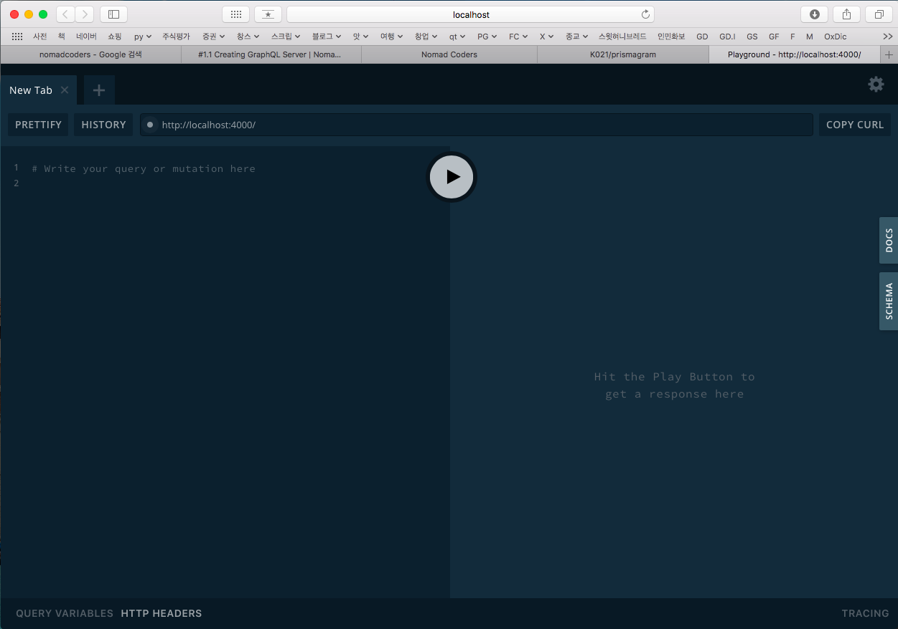
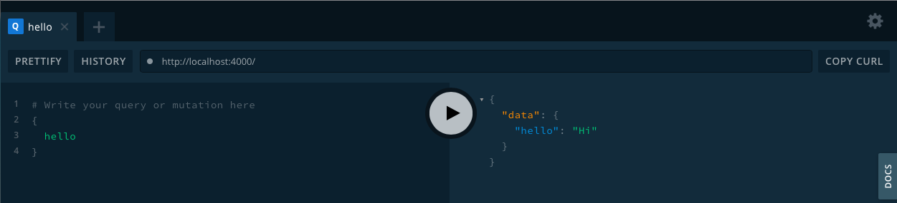

<h1 class="header"><span>Node.js 로 Instagram clone 하기</span></h1>


#### 사용할 주요 기술
- `Node.js`: 백엔드 도구
- `Prisma`: ORM 도구 (DB 쿼리 생성 라이브러리)
- `React`: 프론트엔드 도구
- `React-Native`: 앱을 만들기 위한 도구

#### 사용할 기타 라이브러리
- `Express`:
- `GraphQL`: `express` 서버가 내장되어 있다.
- `Apollo`:
- `Style Commponents`: 
- `typescript`:


# 기본 설정

## 프로젝트 설정
- 프로젝트 폴더 생성: `mkdir prismagram` (`git clone` 을 사용하면 이 과정이 필요없다.)
- git 설정
	- git repository 생성 (생성시 .gitignore 파일도 만들 수 있다)
	- `git clone`
	- `.gitignore` 및 `README.md` 생성
- `yarn init`: yarn 기본 설정을 해준다. 
	- `vim package.json`: `"main": "index.js",` 부분을 제거한다. `index.js` 를 쓰지 않을 예정인 것 같다. 

## dependency 설정
- `yarn add graphql-yoga`
- `yarn add nodemon -D`: `src/server.js` 에 있는 코드를 실행하는 script 를 작성할 때 필요하다. (-D 는 개발용으로 설정)
- ~~`yarn add babel-cli -D`~~: 아래 주석 참조

> - ~~`yarn add babel-cli -D`~~: 아마 니콜라스가 잘못 설치한 것 같다. `babel-node` 를 설치하려다가 오류가 났고, 그 오류에서 이걸 설치하라 그래서 설치한 것인데, 아래에서 바벨 관련 여러 모듈을 설치할 때 이걸 삭제해야만 돌아간다. 이보다는 `@babel/node`를 설치하는 것이 맞는 것 같다.
> - `yarn remove` 는 uninstall 명령어이다. `-g` 로 글로벌 설정을 줄 수 있다. 

## yarn script 설정
```json
{
  "name": "prismagram",
  "version": "1.0.0",
  "description": "Instagram clone with Express + Prisma + React + ReactNative",
  "repository": "git@github.com:K021/prismagram.git",
  "author": "Kim Jooeon <joo2theeon@gmail.com>",
  "license": "MIT",
  "dependencies": {
    "graphql-yoga": "^1.18.0"
  },
  "devDependencies": {
    "babel-cli": "^6.26.0",
    "nodemon": "^1.19.1"
  },
  // scripts 부분을 적어준다
  "scripts": {
    // yarn dev 하면 실행될 명령어이다
    "dev": "nodemon --exec babel-node src/server.js"
  }
}
```
> - `nodemon` 은 파일이 변경될 때마다 알아서 서버를 재실행해주는 녀석이다.
> - `nodemon`이 실행될 때마다 `babel-node server.js`를 실행해주는 듯하다.  
> - `babel` 은 `js`의 버전을 낮춰주는 도구이고,  
> - `babel-node` 는 모르겠다. 뭔가 실행 환경에 맞게 번역해주는 건가.  

## `nodemon.json` 설정
`nodemon`을 설정해주자:

```json
{
  // extension 의 약자로, nodemon 이 감시할 파일의 확장자를 명시한다. 
  "ext": "js graphql"
}
```

## `nodemon` 실행하기
이제 `yarn dev` 명령어로 `nodemon`을 실행하자:

```
yarn run v1.12.3
$ nodemon --exec babel-node src/server.js
[nodemon] 1.19.1
[nodemon] to restart at any time, enter `rs`
[nodemon] watching: *.*
[nodemon] starting `babel-node src/server.js`
[nodemon] clean exit - waiting for changes before restart
```
이 상태에서 `server.js` 를 변경해보자. `console.log('hello');` 를 추가하면, 이것이 반영되는 것을 알 수 있다:

```
yarn run v1.12.3
$ nodemon --exec babel-node src/server.js
[nodemon] 1.19.1
[nodemon] to restart at any time, enter `rs`
[nodemon] watching: *.*
[nodemon] starting `babel-node src/server.js`
[nodemon] clean exit - waiting for changes before restart
[nodemon] restarting due to changes...
[nodemon] starting `babel-node src/server.js`
hello
[nodemon] clean exit - waiting for changes before restart
```
이번에는 `test.js`를 만들고 `console.log('hello!!!');` 를 입력해보자:

```
[nodemon] 1.19.1
[nodemon] to restart at any time, enter `rs`
[nodemon] watching: *.*
[nodemon] starting `babel-node src/server.js`
[nodemon] clean exit - waiting for changes before restart
[nodemon] restarting due to changes...
[nodemon] starting `babel-node src/server.js`
hello
[nodemon] clean exit - waiting for changes before restart
[nodemon] restarting due to changes...
[nodemon] starting `babel-node src/server.js`
hello
[nodemon] clean exit - waiting for changes before restart
```
출력된 것은 `hello!!!` 가 아니라 `hello` 이다. 이로써, 모든 `.js` 파일의 변화를 감지하지만 실행되는 것은 `src/server.js` 뿐임을 알 수 있다. 

이번에는 `test.txt` 를 만들어보자: 아무런 변화도 일어나지 않음을 알 수 있다. 그리고 `test.graphql` 을 만들면 `nodemon` 이 재실행되는 것을 볼 수 있다. 이로써 `nodemon` 이 `nodemon.json` 파일에 기록된 확장자를 감시한다는 것을 알 수 있다.


# Prisma 시작하기
> 서버를 먼저 만들고, 서버에 `Prisma`를 넣는다

## `dotenv` 설치
`yarn add dotenv`: `dotenv` 모듈은 `.env` 파일을 읽는다. 

## `server.js` 수정

```js
require('dotenv').config();
import { GraphQLServer } from 'graphql-yoga';  // graphql server 에는 express server 가 내장되어 있다.

// 설정파일에서 포트 설정을 가져온다. 혹시나를 위해 기본값을 설정해준다. 
// dotenv 가 '.env' 파일을 읽어 환경설정을 해주고, 
// 현재 프로세스의 환경설정에서 포트값을 가져오는 것 같다. 
const PORT = process.env.PORT || 4000;  // '.env'에서 가져온 포트 값. 없으면 4000으로 세팅.

// type definition 과 resolver 을 설정해준다. 
const typeDefs = `
  type Query{
    hello: String!
  }
`;
const resolvers = {
  Query: {
    hello: () => "Hi",
  }
}

// 서버를 만든다
const server = new GraphQLServer({typeDefs, resolvers});

// 서버 시작함수
// port 와 collback function 을 넣는다. 
server.start({ port: PORT }, () => console.log(`Server running on http://localhost:${PORT}`));  // '.env' file 에서 port 를 읽어올 수 있다. ```


## babel 설정

위에 까지만 하고 `yarn dev` 를 하면 다음과 같은 에러가 난다:

```bash
yarn run v1.12.3
$ nodemon --exec babel-node src/server.js
[nodemon] 1.19.1
[nodemon] to restart at any time, enter `rs`
[nodemon] watching: *.*
[nodemon] starting `babel-node src/server.js`
/Users/ElohimAwmar/projects/prismagram/src/server.js:2
import { GraphQLServer } from 'graphql-yoga';
       ^

SyntaxError: Unexpected token {
    at new Script (vm.js:79:7)
    at createScript (vm.js:251:10)
    at Object.runInThisContext (vm.js:303:10)
    at Module._compile (internal/modules/cjs/loader.js:657:28)
    at loader (/Users/ElohimAwmar/projects/prismagram/node_modules/babel-register/lib/node.js:144:5)
    at Object.require.extensions.(anonymous function) [as .js] (/Users/ElohimAwmar/projects/prismagram/node_modules/babel-register/lib/node.js:154:7)
    at Module.load (internal/modules/cjs/loader.js:599:32)
    at tryModuleLoad (internal/modules/cjs/loader.js:538:12)
    at Function.Module._load (internal/modules/cjs/loader.js:530:3)
    at Function.Module.runMain (internal/modules/cjs/loader.js:742:12)
[nodemon] app crashed - waiting for file changes before starting...
```

이는 `node` 가 `import` 명령어를 인식하지 못하기 때문이다. (최신 js 코드를 이해하지 못하는 것 같다) 이를 해결하기 위해 babel 관련 모듈과 설치파일이 필요하다. (js 버전 간의 번역 설정을 해줘야 한다)

## babel 설치

#### 1. babel 관련 모듈 설치
- `yarn add @babel/node` 
- `yarn add @babel/preset-env`
- `yarn add @babel/core`

> - `@babel/node` 를 설치할 예정이므로, 이것을 사용하기 위해 설치했던 `babel-cli` 를 삭제해야 한다. `yarn remove babel-cli`
> - `@babel/node` 는 `babel` 패키지에서 `node` 모듈을 설치한다는 의미이다. `node` 모듈과 `preset-env` 를 동시에 설치하고자 한다면 다음과 같이 할 수 있다: `@babel/{node,preset-env}`
> - 일단 하나를 설치한 후에 `yarn dev` 를 실행하면 추가적으로 설치해야 하는 모듈을 알려준다. 그렇게 하나씩 의존성을 확인하며 설치할 수도 있다. 


#### 2. babel 설정파일 생성 (`.babelrc`)
프로젝트 폴더 바로 아래에 `.babelrc` 파일을 만들고, 다음과 같이 작성한다:

```json
{
  "presets": ["@babel/preset-env"]
}
```

#### 정상 실행
`yarn dev` 를 입력하면 다음과 같이 나온다:

```bash
yarn run v1.12.3
$ nodemon --exec babel-node src/server.js
[nodemon] 1.19.1
[nodemon] to restart at any time, enter `rs`
[nodemon] watching: *.*
[nodemon] starting `babel-node src/server.js`
Server running on http://localhost:4000
```

이제 [http://localhost:4000](http://localhost:4000) 로 들어가면 GraphQL Playground 페이지가 나온다: 



`hello` 쿼리를 던져주면 이전에 입력해두었던 `Hi` 가 나오는 것을 확인할 수 있다.



#### Error: `Requires Babel "^7.0.0-0", but was loaded with "6.26.3".`

```bash
yarn run v1.12.3
$ nodemon --exec babel-node src/server.js
[nodemon] 1.19.1
[nodemon] to restart at any time, enter `rs`
[nodemon] watching: *.*
[nodemon] starting `babel-node src/server.js`
/Users/ElohimAwmar/projects/prismagram/node_modules/babel-core/lib/transformation/file/options/option-manager.js:328
        throw e;
        ^

Error: Requires Babel "^7.0.0-0", but was loaded with "6.26.3". If you are sure you have a compatible version of @babel/core, it is likely that something in your build process is loading the wrong version. Inspect the stack trace of this error to look for the first entry that doesn't mention "@babel/core" or "babel-core" to see what is calling Babel. (While processing preset: "/Users/ElohimAwmar/projects/prismagram/node_modules/@babel/preset-env/lib/index.js")
    at throwVersionError (/Users/ElohimAwmar/projects/prismagram/node_modules/@babel/helper-plugin-utils/lib/index.js:65:11)
    at Object.assertVersion (/Users/ElohimAwmar/projects/prismagram/node_modules/@babel/helper-plugin-utils/lib/index.js:13:11)
    at _default (/Users/ElohimAwmar/projects/prismagram/node_modules/@babel/preset-env/lib/index.js:95:7)
    at /Users/ElohimAwmar/projects/prismagram/node_modules/@babel/helper-plugin-utils/lib/index.js:19:12
    at /Users/ElohimAwmar/projects/prismagram/node_modules/babel-core/lib/transformation/file/options/option-manager.js:317:46
    at Array.map (<anonymous>)
    at OptionManager.resolvePresets (/Users/ElohimAwmar/projects/prismagram/node_modules/babel-core/lib/transformation/file/options/option-manager.js:275:20)
    at OptionManager.mergePresets (/Users/ElohimAwmar/projects/prismagram/node_modules/babel-core/lib/transformation/file/options/option-manager.js:264:10)
    at OptionManager.mergeOptions (/Users/ElohimAwmar/projects/prismagram/node_modules/babel-core/lib/transformation/file/options/option-manager.js:249:14)
    at OptionManager.init (/Users/ElohimAwmar/projects/prismagram/node_modules/babel-core/lib/transformation/file/options/option-manager.js:368:12)
    at compile (/Users/ElohimAwmar/projects/prismagram/node_modules/babel-register/lib/node.js:103:45)
    at loader (/Users/ElohimAwmar/projects/prismagram/node_modules/babel-register/lib/node.js:144:14)
    at Object.require.extensions.(anonymous function) [as .js] (/Users/ElohimAwmar/projects/prismagram/node_modules/babel-register/lib/node.js:154:7)
    at Module.load (internal/modules/cjs/loader.js:599:32)
    at tryModuleLoad (internal/modules/cjs/loader.js:538:12)
    at Function.Module._load (internal/modules/cjs/loader.js:530:3)
    at Function.Module.runMain (internal/modules/cjs/loader.js:742:12)
    at Object.<anonymous> (/Users/ElohimAwmar/projects/prismagram/node_modules/babel-cli/lib/_babel-node.js:154:22)
    at Module._compile (internal/modules/cjs/loader.js:689:30)
    at Object.Module._extensions..js (internal/modules/cjs/loader.js:700:10)
    at Module.load (internal/modules/cjs/loader.js:599:32)
    at tryModuleLoad (internal/modules/cjs/loader.js:538:12)
    at Function.Module._load (internal/modules/cjs/loader.js:530:3)
    at Function.Module.runMain (internal/modules/cjs/loader.js:742:12)
    at startup (internal/bootstrap/node.js:282:19)
[nodemon] app crashed - waiting for file changes before starting...
```

이 에러는 `babel-cli` 를 설치했기 때문에 생긴다. `yarn remove babel-cli` 로 삭제해준다. 아마 `babel-cli` 가 `babel/node` 를 설치하는데, 이전 명령어라 이전 버전으로 설치하는 듯하다.

## Middleware: Loger 설치 (morgan)

> `morgan` 은 로그 기록 전용 모듈로, `express server` 에 미들웨어로 연결해준다.

1. `yarn add morgan`
2. `server.js` 에 반영
3. `yarn dev` 로 로그 확인

#### `server.js` 에 다음 내용 추가
```js
// morgan 모듈 가져오기
import logger from 'morgan';

// logger middleware 추가
// `const server = new GraphQLServer({typeDefs, resolvers});` 밑에 적어준다
server.express.use(logger('dev'));
```

#### 실행결과
`yarn dev`: 다음과 같이 요청 상태 로그를 표시해주는 것을 볼 수 있다. 

```bash
yarn run v1.12.3
$ nodemon --exec babel-node src/server.js
[nodemon] 1.19.1
[nodemon] to restart at any time, enter `rs`
[nodemon] watching: *.*
[nodemon] starting `babel-node src/server.js`
Server running on http://localhost:4000
GET / 200 3.117 ms - -
POST / 200 120.789 ms - 15748
POST / 200 41.765 ms - 15748
POST / 200 23.411 ms - 15748
POST / 200 13.291 ms - 15748
POST / 200 9.262 ms - 15747
POST / 200 15.701 ms - 15748
POST / 200 72.643 ms - 15748
POST / 200 12.181 ms - 15748
POST / 200 15.539 ms - 15748
POST / 200 15.775 ms - 15748
POST / 200 42.830 ms - 15748
```

## typeDefs, resolvers: 좀 더 멋드러지게 추가하기

1. `src/api/` 디렉토리 생성: 모든 `graphql` 파일과 `resolver`파일들을 저장한다.
2. `src/schema.js` 생성: 위의 파일들을 여기서 합친다. 이 파일이 `typeDefs`와 `resolvers`를 모두 갖고 있게 한다.
3. 필요한 모듈 설치
	- `yarn add graphql-tools`
	- `yarn add merge-graphql-schemas` 
4. 설치한 모듈을 `schema.js`에 반영
5. 테스트를 위한 `api/Hello/sayHello/` 밑에 있는 `sayHello.graphql`과 `sayHello.js` 를 작성
6. `src/api/` 아래에 있는 `.graphql`, `.js` 파일을 `schema.js` 에서 합쳐준다.
7. `server.js` 에서 `schema.js` 로드
8. 동작 확인: `yarn dev`

#### `schema.js`
```js
import { makeExecutableSchema } from 'graphql-tools';
import { fileLoader, mergeResolvers, mergeTypes } from 'merge-graphql-schemas';
```

#### `sayHello.graphql`
> `server.js` 에 있던 `typeDefs` 의 쿼리 정보를 적어준다

```
type Query{
  sayHello: String!
}
```

#### `sayHello.js`
> `server.js` 에 있던 `resolvers` 의 쿼리 정보를 적어준다. 

```
export default {
  Query: {
    sayHello: () => "Hello",
  }
}
```

#### `schema.js` 에서 합치기
```js
import path from 'path';
import { makeExecutableSchema } from 'graphql-tools';
import { fileLoader, mergeResolvers, mergeTypes } from 'merge-graphql-schemas';

// fileLoader 에는 파일 path 를 입력해준다.
// ** 는 중간에 몇개의 폴더가 있던 상관이 없음을 의미한다.
const allTypes = fileLoader(path.join(__dirname, '/api/**/*.graphql'));
// `api/` 밑에는 resolver 가 아닌 js 파일을 두면 안 된다는 것을 알 수 있다. 
const allResolvers = fileLoader(path.join(__dirname, 'api/**/*.js'))

// 인자로 typeDefs 와 resolvers 를 넘겨준다.
const schema = makeExecutableSchema({
  typeDefs: mergeTypes(allTypes),
  resolvers: mergeResolvers(allResolvers),
})
export default schema;
```

#### `server.js` 반영
변경사항:

```js
// typeDefs 와  resolvers 를 지우고 아래로 대체한다. 
import schema from './schema';
const server = new GraphQLServer({ schema });
```
결과:

```js
require('dotenv').config();
import { GraphQLServer } from 'graphql-yoga';
import logger from 'morgan';
import schema from './schema';

// 설정파일에서 포트 설정을 가져온다. 혹시나를 위해 기본값을 설정해준다. 
// dotenv 가 '.env' 파일을 읽어 환경설정을 해주고, 
// 현재 프로세스의 환경설정에서 포트값을 가져오는 것 같다. 
const PORT = process.env.PORT || 4000;  // '.env'에서 가져온 포트 값. 없으면 4000으로 세팅.

// 서버를 만든다
const server = new GraphQLServer({ schema });

// logger middleware 추가
server.express.use(logger('dev'));

// 서버 시작함수
// port 와 collback function 을 넣는다. 
server.start({ port: PORT }, () => console.log(`Server running on http://localhost:${PORT}`));  // '.env' file 에서 port 를 읽어올 수 있다. 
```

#### 원래 `server.js`
```js
require('dotenv').config();
import { GraphQLServer } from 'graphql-yoga';
import logger from 'morgan';

// 설정파일에서 포트 설정을 가져온다. 혹시나를 위해 기본값을 설정해준다. 
// dotenv 가 '.env' 파일을 읽어 환경설정을 해주고, 
// 현재 프로세스의 환경설정에서 포트값을 가져오는 것 같다. 
const PORT = process.env.PORT || 4000;  // '.env'에서 가져온 포트 값. 없으면 4000으로 세팅.

// type definition 과 resolver 을 설정해준다. 
const typeDefs = `
  type Query{
    hello: String!
  }
`;
const resolvers = {
  Query: {
    hello: () => "Hi",
  }
}

// 서버를 만든다
const server = new GraphQLServer({typeDefs, resolvers});

// logger middleware 추가
server.express.use(logger('dev'));

// 서버 시작함수
// port 와 collback function 을 넣는다. 
server.start({ port: PORT }, () => console.log(`Server running on http://localhost:${PORT}`));  // '.env' file 에서 port 를 읽어올 수 있다. 
```


## 공부할 것들
- `type definition`
- js 에서 백틱(`)의 의미
- `babel` 의 모듈들과 `.babelrc` 파일의 의미
- `babel-cli` 는 `@babel/node` 를 포함하는가?
- export 의 의미