<h1 class="header"><span>Xenmark Guide</span></h1>

# Xenmark language

## 1. xenmark:

: 코드의 직접적인 수정 없이도, pdxen 홈페이지의 게시글을 간편하게 수정하기 위한 [마크업 언어](https://namu.wiki/w/%EB%A7%88%ED%81%AC%EC%97%85%20%EC%96%B8%EC%96%B4)이다.

## 2. xenmark로 변환된 html 뷰

> 본격적으로 들어가기 전에 어떤 요소가 사용되었는지, 각 요소의 스타일은 어떤지 살펴보자.

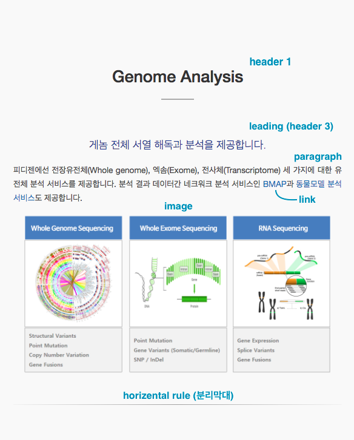  
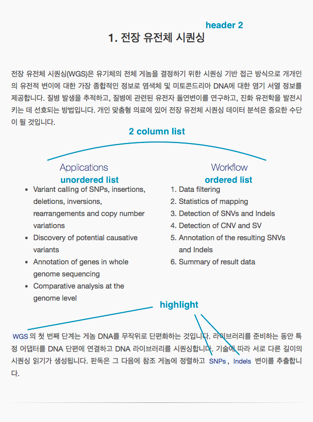  
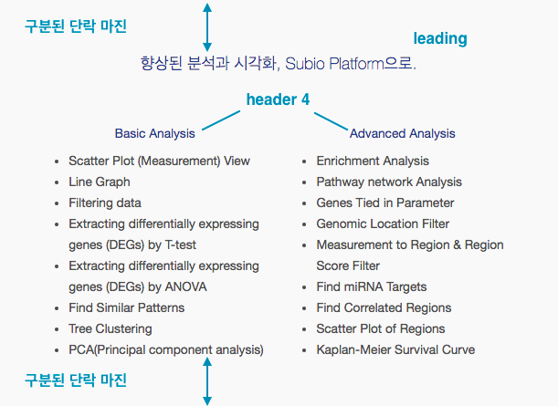

## 3. xenmark language

> **표시자**: xenmark 문서를 html 문서로 변환하기 위한 구분자로, html tag에 해당한다고 보면 쉽다. 

##### xenmark 표시자와 각 표시자 사용법

```
# 가장 큰 제목 (h1)
## 중간 제목 (h2)
### 리딩 문구 (h3)
#### 가장 낮은 단계 제목 (h4)
@이것은 일반문단 입니다. 그 중에 `하이라이트`가 들어있습니다.
[링크 이름](링크 주소)
---
                # 엔터 두 번으로 단락을 구분합니다. 
- 순서 없는 리스트
- 순서 없는 리스트
- 순서 없는 리스트
1. 순서 있는 리스트
2. 순서 있는 리스트
3. 순서 있는 리스트
---
                # 엔터 두 번으로 단락을 구분합니다. 
|2-1|
- 순서 없는 리스트
- 순서 없는 리스트
- 순서 없는 리스트
|2-2|
1. 순서 있는 리스트
2. 순서 있는 리스트
3. 순서 있는 리스트
|2-0|
|(이미지파일명.확장자)|
```

##### 공통 문법
- header(`#`), paragraph(`@`), list(`-`, `1.`) 구분자는 해당 줄 맨 앞에 와야 한다. 그 앞에 어떤 문자도 있어서는 안 된다. 구분자로 한 줄이 시작해야 한다는 의미.
- link와 highlight는 header, paragraph, list 안 어디에나 올 수 있다. 

##### header
- `#`: 가장 큰 제목. h1에 해당된다. 
- `##`: 두 번째 큰 제목. h2에 해당된다.
- `###`: 세번째 큰 제목으로, `리딩`이라고 부른다. h1과 h2 밑에서 부제목 느낌으로 사용된다. h3에 해당된다. 
- `####`: 가장 작은 제목으로, 리딩의 하위제목이 필요할 때 사용한다. h4에 해당된다. 

##### paragraph
- `@`: 일반 문단을 가리키는 p 태그이다. 유일하게 줄바꿈을 해도 문제가 생기지 않는다. 문단을 나누어주고 싶을 때는 @를 붙인 새로운 줄로 시작한다. (자세한 것은 아래의 예시를 보면 알 수 있다.)

##### link
- `[링크 이름](링크 주소)`: 링크다. a 태그에 해당되며, 링크 주소에는 `http://` 또는 `https://` 가 포함되어야 한다. 

##### highlight
- ``` `` ```: 글자는 피디젠 남색으로, 배경은 밝은 하늘색으로 감싸주는 하이라이트 기능이다. `tilda`(``` ` ```) 사이에 원하는 말을 넣는다.

##### horizental rule (분리막대)
- `---`: 좌우를 가로지르는 얇은 막대로, 문맥을 끊어주는 구분자 역할을 한다. hr 태그에 해당된다.

##### list
- `-`: 순서 없는 리스트. 대쉬(`-`) 뒤에 반드시 하나 이상의 공백(`' '`)이 와야 한다. `- 리스트입니다`와 같은 식으로. 
- `1.`: 순서 있는 리스트. 숫자와 점(`.`) 그리고 공백(`' '`)으로 이루어져 있다. 어떤 숫자를 사용하던 1부터 순서대로 나열된다. 
- `|2-1|`: 2열 리스트의 첫 번째 리스트
- `|2-2|`: 2열 리스트의 두 번째 리스트
- `|2-0|`: 2열 리스트의 마지막 표시자

##### image 
- `|(이미지파일명.확장자)|`: 확장자를 반드시 포함하여야 하며, 업로드한 이미지와 일치하는 이름이어야 한다. 

##### 단락 구분자
- `줄바꿈 두 번`: xenmark 에서는 2번 이상의 줄바꿈은 단락의 변화를 나타낸다. 구분된 단락은 위아래의 약 50px 정도의 마진을 갖는다. 

##### html 로 변환된 xenmark 표시자

```html
/* 가장 큰 제목 */
<h1 class="contents"></h1>

/* 두 번째 제목 */
<h2 class="contents"></h2>

/* 리딩 */
<h3 class="contents"></h3>

/* 가장 낮은 단계 제목 */
<h4 class="contents"></h4>

/* 일반 문단 */
<p class="contents"></p>

/* 하이라이트 */
<code></code>

/* 링크 */
<a href=""></a>

/* 순서 없는 리스트 */
<ul class="contents">
    <li></li>
</ul>

/* 순서 있는 리스트 */
<ol class="contents">
    <li></li>
</ol>

/* 분리 막대 */
<hr class="margin4">

/* 줄바꿈 두 번으로 구분되는 한 단락 */
<div class="paragraph text-justify"></div>

/* 2열 리스트 */
<div class="paragraph column2-wrapper clearfix text-left">
    <div class="first-column col-md-6"></div>
    <div class="second-column col-md-6"></div>
</div>
    
/* 최대 800px로 꽉차는 이미지 */

```

## 4. 이해를 돕기 위한 예시

##### Xenmark

```
# 가장 큰 제목
### 이것이 리딩입니다. 글의 핵심을 표현하는 부제목이죠.
@ 이것은 일반 문단입니다. 문단 중간에 `하이라이트`가 들어갈 수 있습니다. 
물론 [링크](http://naver.com)도 들어갈 수 있죠. 
가독성을 위해 줄바꿈을 한번 해줘도 상관 없습니다. 하지만 두 번은 안 됩니다.
이런 식으로 글을 계속 작성하다보면 문단을 나눠야 할 필요가 생깁니다.
@ 그럴때는 이렇게 문단을 나누어 주면 깔끔합니다. 
이러한 유전정보를 활용하여 만든 연구를 통해 생명공학은 비약적으로 발전해 나갈 것이다. 그러나 기존의 전임상 모델에서
탁월한 항암 효과를 보여 임상 시험까지 진입한 치료제의 약 90%가 실제 환자에서 유의한 암 진행의
억제 및 생존 연장을 유도하지 못하는데, 이는 기존에 사용되는 전임상 검증 시스템에 표적 치료제 개발
시대에 적합한 대안적인 모델이 필요함을 의미한다. 이에 면역 결핍 마우스의 정위적으로 종양조직을
이식하는 모델 확립 및 이를 통한 환자 유래 세포주 및 라이브러리 구축을 통해 실제 종양 환자의 싱물학적
및 분자적 특성, 유전형, 치료에 대한 반응성 및 예후를 포함한 임상 양상을 최대한 가깝게 재현하고
임상 시험에서의 항암 효과를 정확하게 예견하고자 합니다.
|(genome-analysis.png)|
---

## 두 번째 제목
- 순서 없는 리스트
- 순서 없는 리스트
- 순서 없는 리스트
1. 순서 있는 리스트
2. 순서 있는 리스트
3. 순서 있는 리스트
---

|2-1|
#### 가장 낮은 단계 제목은
- 순서 없는 왼쪽 배열 리스트
- 순서 없는 왼쪽 배열 리스트
- 순서 없는 왼쪽 배열 리스트
|2-2|
#### 이런 곳에 사용하는 겁니다.
1. 순서 있는 오른쪽 배열 리스트
2. 순서 있는 오른쪽 배열 리스트
3. 순서 있는 오른쪽 배열 리스트
|2-0|
```

##### html

```html
<div class="paragraph text-justify">
    <h1 class="contents">가장 큰 제목</h1>
    <h3 class="contents">이것이 리딩입니다. 글의 핵심을 표현하는 부제목이죠.</h3>
    <p class="contents">이것은 일반 문단입니다. 문단 중간에 <code>하이라이트</code>가 들어갈 수 있습니다. 물론 <a
            href="http://naver.com">링크</a>도 들어갈 수 있죠. 가독성을 위해 줄바꿈을 한번 해줘도 상관 없습니다. 하지만 두 번은 안 됩니다. 이런 식으로 글을 계속
        작성하다보면 문단을 나눠야 할 필요가 생깁니다.</p>
    <p class="contents">그럴때는 이렇게 문단을 나누어 주면 깔끔합니다. 이러한 유전정보를 활용하여 만든 연구를 통해 생명공학은 비약적으로 발전해 나갈 것이다. 그러나 기존의 전임상
        모델에서 탁월한 항암 효과를 보여 임상 시험까지 진입한 치료제의 약 90%가 실제 환자에서 유의한 암 진행의 억제 및 생존 연장을 유도하지 못하는데, 이는 기존에 사용되는 전임상 검증
        시스템에 표적 치료제 개발 시대에 적합한 대안적인 모델이 필요함을 의미한다. 이에 면역 결핍 마우스의 정위적으로 종양조직을 이식하는 모델 확립 및 이를 통한 환자 유래 세포주 및
        라이브러리 구축을 통해 실제 종양 환자의 싱물학적 및 분자적 특성, 유전형, 치료에 대한 반응성 및 예후를 포함한 임상 양상을 최대한 가깝게 재현하고 임상 시험에서의 항암 효과를 정확하게
        예견하고자 합니다.</p>
    
    <hr class="margin4">
</div>

<div class="paragraph text-justify">
    <h2 class="contents">두 번째 제목</h2>
    <ul class="contents">
        <li>순서 없는 리스트</li>
        <li>순서 없는 리스트</li>
        <li>순서 없는 리스트</li>
    </ul>
    <ol class="contents">
        <li>순서 있는 리스트</li>
        <li>순서 있는 리스트</li>
        <li>순서 있는 리스트</li>
    </ol>
    <hr class="margin4">
</div>

<div class="paragraph text-justify">
    <div class="paragraph column2-wrapper clearfix text-left">
        <div class="first-column col-md-6">
            <h4 class="contents">가장 낮은 단계 제목은</h4>
            <ul class="contents">
                <li>순서 없는 왼쪽 배열 리스트</li>
                <li>순서 없는 왼쪽 배열 리스트</li>
                <li>순서 없는 왼쪽 배열 리스트</li>
            </ul>
        </div>
        <div class="second-column col-md-6">
            <h4 class="contents">이런 곳에 사용하는 겁니다.</h4>
            <ol class="contents">
                <li>순서 있는 오른쪽 배열 리스트</li>
                <li>순서 있는 오른쪽 배열 리스트</li>
                <li>순서 있는 오른쪽 배열 리스트</li>
            </ol>
        </div>
    </div>
</div>
```

##### view

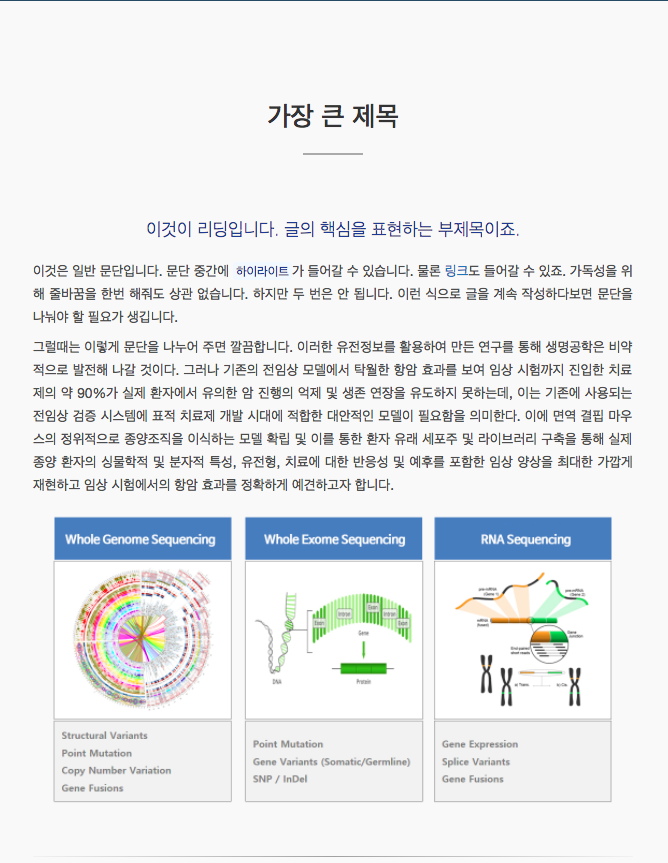  
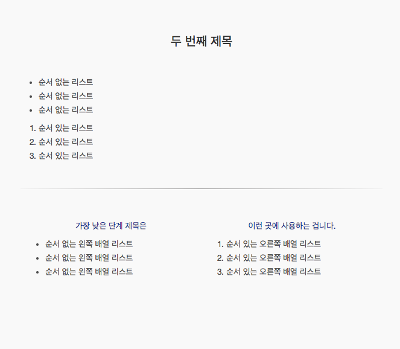 


# xenmark로 post 작성하기


## 1. pdxen.com 로그인, 에디터 페이지 접속
> ID: `pdxen.ask@gmail.com`
> PW: `PdxenAdmin762!`

1. pdxen.com 오른쪽 상단 `Log in` 버튼 클릭 또는 `pdxen.com/login/` 접속
2. 위의 master 계정으로 로그인
3. 오른쪽 상단의 `Editor` 버튼 클릭 또는 `pdxen.com/editor/`접속

### 에디터 페이지 구성

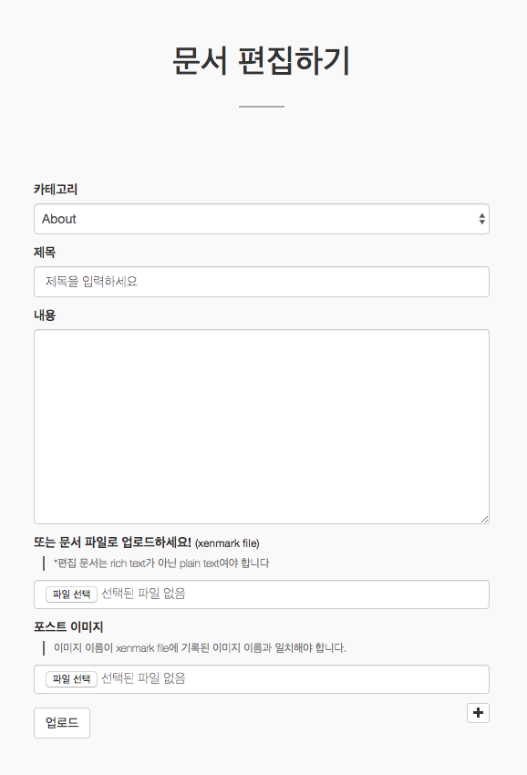

##### 반드시 입력해야 하는 필수필드
- 카테고리, 제목
- 내용과 `xenmark file` 업로드 중 하나 필수 입력

##### 카테고리
- 글의 분류를 정하는 것으로, `about`, `products`, `services`에 해당하는 `Category`와 그 하위의 `Sub-category`로 구성된다. 

##### 제목
- `Sub-category`가 없을 때 그것을 대신한다.

##### 내용
- html로 변환될 xenmark 문서를 작성한다.

##### xenmark file upload
- xenmark로 작성된 text file을 업로드한다. 
- 반드시 `.txt` 파일이어야 하고, `utf-8`로 인코딩된 문서여야 한다. [참조: xenmark 문서 작성 또는 파일 업로드](#xenmark-file-upload)
- '내용' 부분이 입력되었을 경우, 추가적인 업로드가 필요하지 않다. 내용과 파일 업로드 중 하나를 생략할 수 있다.

##### image file upload
- xenmark 문서에 포함된 이미지를 업로드
- xenmark 문서에 기록된 이미지 이름과 같은 이름의 파일이어야 한다. (확장자도 같아야 한다.)
- 아래의 `+` 버튼을 누르면 이미지 필드가 증가하여 여러개를 업로드할 수 있다.


## 2. 카테고리 선택

> 카테고리는 작성할 포스트의 분류를 나타낸다. 작성할 수 있는 카테고리는 제한되어 있는데, 그것은 다음과 같다. 

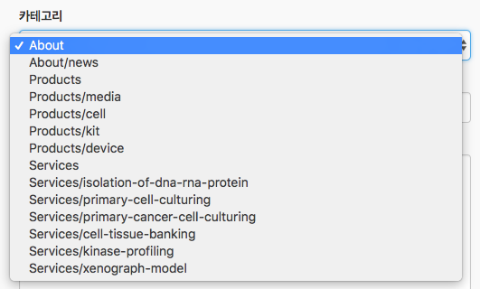

### 접근이 허용된 카테고리 종류 (Category/Sub-category)
- about
- about/news
<hr class="clear">
- products
- products/media
- products/cell
- products/kit
- products/device
<hr class="clear">
- services
- services/isolation-of-dna-rna-protein
- services/primary-cell-culturing
- services/primary-cancer-cell-culturing
- services/cell-tissue-banking
- services/kinase-profiling
- services/xenograph-model

### Category / Sub-category

> 1. Catogory 는 `about`, `products`, `services` 페이지를 의미한다.
> 2. Sub-category 는 그 하위의 탭들을 의미한다.
> 3. Category 만 있는 항목을 선택하면, Sub-category에는 그 아래서 설정하는 그 글의 제목이 자동저장 된다. 
  
Category 만 있는 것을 선택하면, 해당 카테고리 내에 새로운 탭이 하나 생기게 된다.  

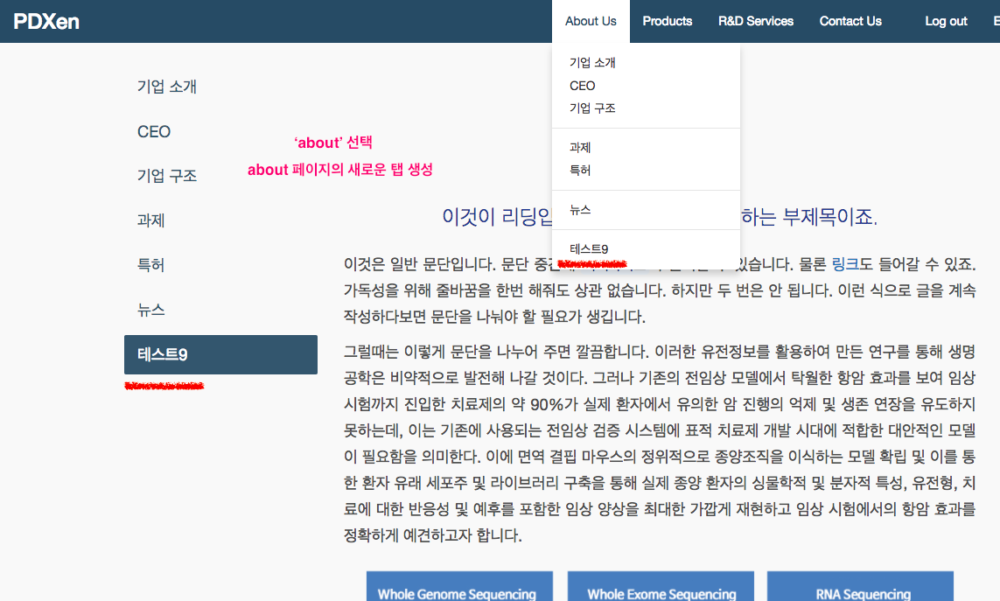

Category/Sub-category 를 선택하면, 해당 카테고리의 해당 탭 내에 글이 추가된다.

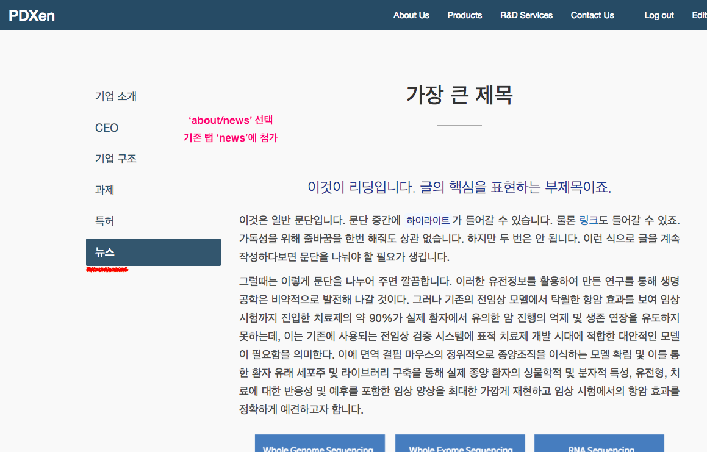


## 3. 제목 선택

> 글의 제목은, Sub-category가 없는 경우에 Sub-category의 대용으로서 사용하게 된다. 하지만 Sub-category를 설정한 경우에도 제목을 입력해야 한다. 

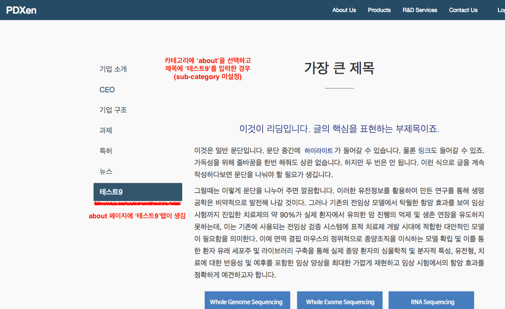

<a id="xenmark-file-upload"></a>


## 4. xenmark 문서 작성 또는 파일 업로드

> 둘 중 하나만 하면 된다. 굳이 둘 다 한 경우에는 업로드된 파일을 우선한다.  
> 윈도우에서 작성한 txt file은 `utf-8`로 인코딩되어 있어야 한다. 맥은 그냥 하면 된다.

##### 윈도우에서 텍스트파일(`.txt`) `utf-8`로 저장하기
메모장에서 작성하고, 문서를 저장할 때 아래 인코딩 옵션에서 `utf-8` 옵션을 선택해준다.

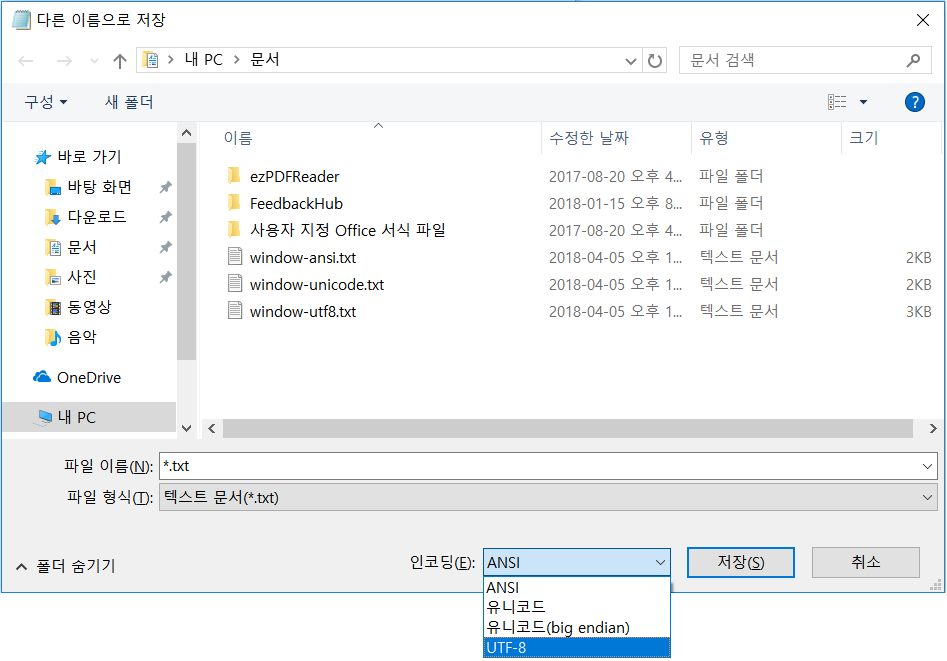


## 5. 이미지 업로드

> - xenmark 문서에 기록된 이미지와 파일의 이름과 확장자가 동일해야 한다. (확장자도 같아야 한다.)
> - 아래의 `+` 버튼을 누르면 이미지 필드가 증가하여 여러개를 업로드할 수 있다.
> - xenmark 에 사용된 이미지가 이미 업로드된 적이 있는 경우에는, 다시 업로드할 필요가 없다.

##### 이미지 필드가 증가한 모습
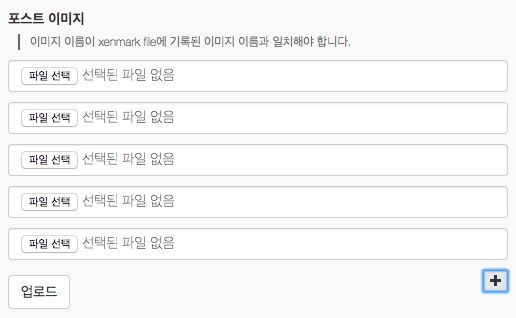
 